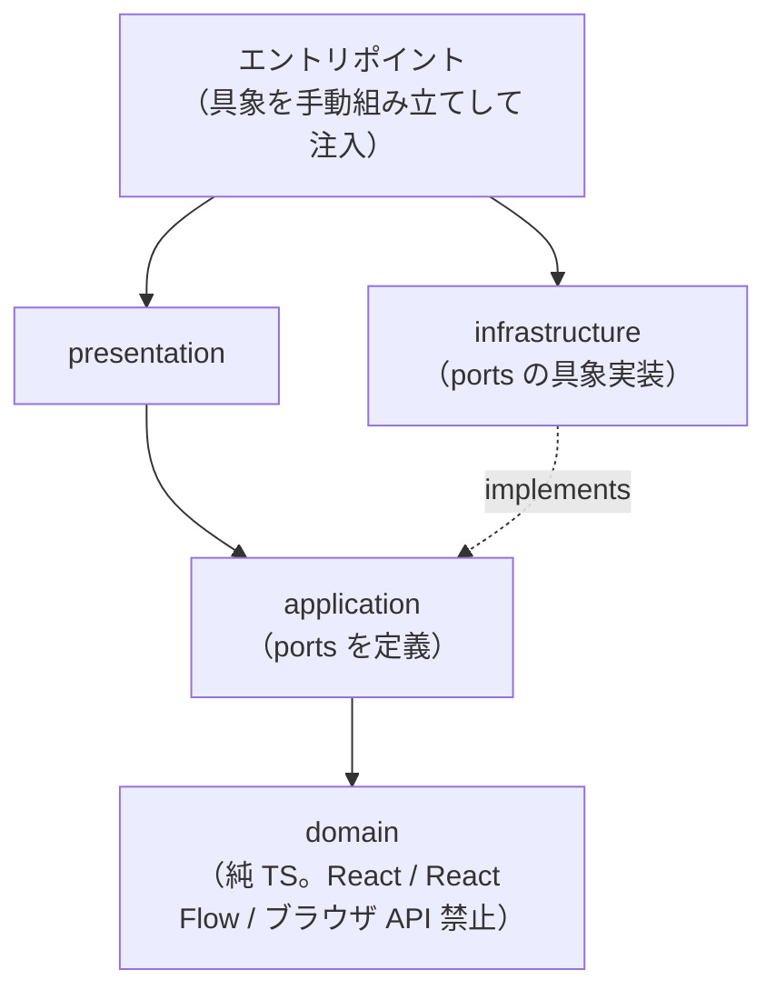

# GOOYA Canvas 技術仕様書

本書は GOOYA Canvas の技術選択・実行/配備構成・モジュール境界・依存方向・横断的制約を定義する永続的ドキュメントである。
ユーザー価値・スコープは `docs/product-requirements.md`（FR / NFR の各 ID）を、レイヤー責務・ポート（interface）の定義場所・実装場所・注入方法の詳細は `docs/functional-design.md` §2 を参照する（本書では重複させない）。

---

## 1. テクノロジースタック

選定済みライブラリはすべて Phase 0 で導入を完了している。以下は `package.json` の実値（`^` / `~` はレンジ指定をそのまま記載）。

### 1.1 実行時依存（dependencies）

| ライブラリ | バージョン | 役割 |
|---|---|---|
| react / react-dom | ^19.2.8 | UI ライブラリ |
| @xyflow/react | ^12.11.6 | Canvas Engine（React Flow。ノード描画・接続・Zoom/Pan/Selection/MiniMap — AD-02） |
| zustand | ^5.0.15 | State 管理（Domain Model を Source of Truth として一元管理 — AD-03） |
| zundo | ^2.3.0 | Undo / Redo（Zustand middleware、FR-005 — AD-07） |
| zod | ^4.5.4 | プロジェクト JSON の schema validation（NFR-005 — AD-04） |
| html-to-image | ^1.11.13 | Canvas の高解像度 PNG 化（FR-016 — AD-06） |
| jspdf | ^4.2.1 | PDF 合成・出力（FR-017 — AD-06） |

### 1.2 開発時依存（devDependencies）

| ライブラリ | バージョン | 役割 |
|---|---|---|
| typescript | ~6.0.2 | 型システム。`tsc -b` で型検査 |
| vite | ^8.2.2 | 開発サーバー・バンドラ |
| @vitejs/plugin-react | ^6.1.0 | Vite の React 統合 |
| tailwindcss / @tailwindcss/vite | ^4.3.3 | スタイリング（AD-05）。Vite プラグイン方式で適用する（§1.3） |
| vitest | ^5.0.0 | Unit テストランナー（§6.1 — AD-09） |
| @playwright/test | ^1.63.0 | E2E テスト（§6.2 — AD-09） |
| prettier | ^3.9.6 | フォーマッタ（§5.2） |
| eslint | ^10.9.0 | 静的解析の本体 |
| @eslint/js | ^10.0.1 | ESLint 標準推奨ルールセット |
| typescript-eslint | ^8.67.0 | TypeScript 向けルール・パーサ |
| eslint-config-prettier | ^10.1.8 | Prettier と競合する整形系ルールの無効化 |
| eslint-plugin-import-x | ^4.17.1 | 依存方向の機械的担保（§3.2。`import-x/no-restricted-paths`） |
| eslint-import-resolver-typescript | ^4.4.5 | `import-x` の import 解決（§1.3） |
| eslint-plugin-react-hooks | ^7.1.1 | Hooks ルール |
| eslint-plugin-react-refresh | ^0.5.4 | HMR 境界のルール |
| globals | ^17.11.0 | ブラウザグローバルの定義 |
| @types/node | ^24.13.3 | Vite / ESLint 設定ファイル用の Node 型 |
| @types/react / @types/react-dom | ^19.2.18 / ^19.2.4 | React の型定義 |

### 1.3 選定上の確定事項（Phase 0）

- **Tailwind CSS は v4 系で、Vite プラグイン方式（`@tailwindcss/vite`）を採用する。** v4 では Vite プラグインが公式の推奨経路であり、PostCSS 設定ファイルが不要になるため。スタイルのエントリは `src/index.css` で、**Tailwind の読込はその先頭 `@import 'tailwindcss'` の 1 行のみ**。ほかには最小限のベース指定（ルート要素 `html` / `body` / `#root` の高さ、および System Font の `font-family` — NFR-004）だけを置き、コンポーネント固有のスタイルは書かない。
- **`eslint-plugin-import` は採用せず `eslint-plugin-import-x` を採用する。** `eslint-plugin-import` の peerDependencies が ESLint `^9` までで、本プロジェクトの ESLint 10 に対応していないため。ルール名は `import-x/no-restricted-paths`（§3.2）。
- **`eslint-import-resolver-typescript` を追加する。** 拡張子を省略した import と `@/` エイリアスを解決できないと `no-restricted-paths` の zones が発火しないため（Phase 0 の実測で確認済み）。
- **Radix UI は未導入とする。** 現時点で必要な UI プリミティブがなく、特定 UI フレームワークへ強依存しない方針（NFR-011）と整合する。必要になった時点で導入を判断する。
- **導入済みだが使用開始が後続フェーズのもの**: zundo は Phase 8（Undo / Redo）、Zod は Phase 4（プロジェクト JSON validation）、html-to-image / jsPDF は Phase 7（PNG / PDF Export — FR-016, FR-017）、Playwright による E2E は Phase 5。依存を先行導入することでフェーズ着手時のセットアップ差分を無くす（フェーズ定義は `development-roadmap.md`）。
- ID 採番はライブラリを使わず標準 API `crypto.randomUUID()` を用いる（AD-08）。

## 2. 採用したアーキテクチャ選択とその理由

| ID | 決定 | 理由 |
|---|---|---|
| AD-01 | **React + Vite の SPA。Next.js 不採用** | MVP は DB・認証・API・SSR・SEO・Server Actions・サーバーサイドデータ取得がすべて不要で、中心は Canvas 操作・state 管理・drag & drop・ブラウザ File API・Export・Prompt 生成という Client Side 処理（メモ §7）。将来 SSO・組織認証・AI API proxy・Google Drive 直接保存・プロジェクト共有・共同編集・Audit Log を実装する際にフルスタック構成を再検討する |
| AD-02 | **Canvas Engine に @xyflow/react を採用** | Node dragging / Edge connection / Zoom / Pan / Selection / Multi-selection / Viewport / MiniMap / Controls を自前実装しない（メモ §6）。GOOYA Canvas 独自機能は Custom Node として実装する |
| AD-03 | **State 管理に Zustand を採用** | nodes / edges に加え project metadata・選択状態・inspector state・prompt settings・history・dirty state を単一 store で一元管理する（メモ §6） |
| AD-04 | **Validation に Zod を採用** | 読み込んだプロジェクト JSON を必ず validate し、未知・破損・古い schemaVersion をそのまま state へ入れない（NFR-005） |
| AD-05 | **Styling に Tailwind CSS（v4、Vite プラグイン方式）を採用** | Canvas 本体のノードは独自デザインとし、特定 UI フレームワークへ強依存しない（NFR-011）。Radix UI 等は現時点で未導入とし、必要になった時点で判断する（§1.3） |
| AD-06 | **Export は html-to-image（PNG）+ jsPDF（PDF）** | Browser Only（NFR-001）でサーバーレンダリングを持たないため、DOM → 画像化 → PDF 合成をすべてブラウザ内で完結させる |
| AD-07 | **Undo / Redo に zundo を採用** | Zustand middleware として store の `nodes` / `edges` のみを履歴追跡でき、AD-03 と整合する（履歴対象の詳細は functional-design §11） |
| AD-08 | **ID 採番は `crypto.randomUUID()`** | Browser Only で衝突耐性のある一意 ID を依存ライブラリなしで得られる |
| AD-09 | **テストは Vitest（Unit）+ Playwright（E2E）** | Vite との親和性、および主要導線の E2E 検証（メモ §42、§6 参照） |
| AD-10 | **DI コンテナ不採用** | ポート具象はエントリポイントで手動組み立てし、application service へ引数または生成時注入で束ねる。ポート 5 種・単一エントリポイントの規模に対して DI コンテナは過剰（functional-design §2.3） |
| AD-11 | **サーバー・DB・認証を持たない Browser Only** | プロジェクトファイル `*.gooya-canvas.json` を正式な保存先とし、Workflow をサーバーへ送信しない（NFR-001、メモ §39） |
| AD-12 | **デプロイ先は GitHub Pages（github.io）** | サーバーサイド処理のない静的 SPA（AD-01, AD-11）に十分で、GitHub Actions による build → deploy の自動化と整合する。リポジトリ名サブパス配信のため Vite の `base` 設定が必要（§4） |

## 3. アーキテクチャ原則とその担保

ドメイン駆動 × レイヤード（モジュラモノリス）を採用する。原則の宣言に留めず、以下の機械的担保と規約で維持する。

### 3.1 モジュール境界と依存方向

- モジュールは `workflow`（コアドメイン・純 TypeScript）/ `canvas` / `inspector` / `project` / `export` / `prompt` / `review` / `shared` の 8 つ（各モジュールの責務は functional-design §2.1 が所有）。
- 各モジュール内のレイヤー依存は一方向 `presentation → application → domain` に限定し、infrastructure は application が定義するポートを実装する（DIP。ポート 5 種の定義・実装・注入は functional-design §2.3 が所有）。
- モジュール間は他モジュールの内部実装を直接 import しない。共有は `workflow`（Domain Model）または `shared` を経由する。



### 3.2 依存方向の機械的担保（ESLint import 制約）

`eslint-plugin-import-x` の `import-x/no-restricted-paths`（zones）を導入し、`npm run lint` で以下を強制する（プラグイン選定の理由は §1.3）。zones は相対パス解決に依存するため、`eslint-import-resolver-typescript` を resolver として設定する。

| 制約 | 内容 |
|---|---|
| domain 最内層 | `src/modules/*/domain/**` から `application` / `presentation` / `infrastructure` への import を禁止。加えてパッケージ import は `react` / `react-dom` / `@xyflow/react` の 3 つを禁止 |
| application の DIP | `src/modules/*/application/**` から `infrastructure` / `presentation` への import を禁止（infrastructure 具象はエントリポイントのみが import できる） |
| 逆流禁止 | `application` → `presentation`、`domain` → 上位レイヤーの import を禁止 |
| モジュール間境界 | `src/modules/<A>/**` から `src/modules/<B>/**` の内部（`workflow` の公開 API と `shared` を除く）への import を禁止 |
| React Flow の封じ込め | `@xyflow/react` の import を `canvas` モジュール（ただし `src/modules/canvas/domain/**` を除く）以外で禁止。canvas の domain 層でも React Flow 型は使えない |

**機械担保の範囲**: domain 層で ESLint が禁止できるのは上記のとおり **`react` / `react-dom` / `@xyflow/react` の 3 パッケージと上位レイヤーへの相対 import** に限られる。`fetch` / `localStorage` / `crypto` / `Date` などブラウザグローバルの直接使用は import を伴わないため ESLint では検出できず、domain の純粋性（§3.4）は**人手レビューの観点**として担保する（レビュー規約は `development-guidelines.md` §7.2 が所有）。

具体的な zones 設定（グロブ）は `eslint.config.js` に記述し、配置規則の詳細は `repository-structure.md` が所有する。`@/` エイリアス経由の import specifier は zones では捕捉しきれないため、同じ制約を `no-restricted-imports`（paths / patterns）で二重に張る。

### 3.3 外部 SDK 型の境界規約

- **Source of Truth は Zustand store が保持する Domain Model**。@xyflow/react の `Node` / `Edge` 型は `canvas` モジュール内の mapper（`src/modules/canvas/presentation/reactFlowMapper.ts`）でのみ扱い、store・domain・application の公開シグネチャに React Flow 型を出さない（NFR-010、functional-design §2.4）。
- mapper が公開する関数は次の 6 つ。単一の逆変換関数（`fromReactFlow`）は持たず、React Flow が渡してくる値の種類ごとに分ける。

| 関数 | 方向 | 役割 |
|---|---|---|
| `toReactFlow` | Domain → React Flow | `WorkflowGraph` を React Flow の `nodes` / `edges` へ写像する |
| `fromReactFlowConnection` | React Flow → Domain | `Connection`（接続イベント）を Edge 生成用の端点情報へ正規化する |
| `fromReactFlowPosition` | React Flow → Domain | `XYPosition` を `WorkflowPosition` へ変換する |
| `fromReactFlowIds` | React Flow → Domain | `{ id }[]`（選択・削除対象）を ID 配列へ変換する |
| `mergeReactFlowNodes` | Domain → 既存 React Flow 配列 | Domain の変更を既存 `nodes` 配列へマージする |
| `mergeReactFlowEdges` | Domain → 既存 React Flow 配列 | Domain の変更を既存 `edges` 配列へマージする |

- **merge が必要な理由**: React Flow は `measured`（測定済みサイズ）や `selected` を、渡したオブジェクト自身に保持する。そのため Domain から毎回オブジェクトを作り直すとこれらが失われ、MiniMap が描画されないなどの不整合が起きる。`mergeReactFlow*` は既存要素の参照を維持し、変化が無ければ同一参照（配列ごと同一）を返すことでこれを避ける。
- 命名規則（`toReactFlow` / `fromReactFlow*` / `mergeReactFlow*` の使い分け）は `glossary.md` §5 が所有する。
- infrastructure の具象（Blob / File Picker / Clipboard / localStorage / html-to-image / jsPDF）が返す値は、ポートのシグネチャが定める型（`string` / `Blob` / ドメイン型）へ境界内で変換してから返す。ライブラリ固有の型・例外をポートの外へ漏らさない。

### 3.4 純粋性の担保

- `workflow` ドメイン（型・Zod スキーマ・接続ルール・migration レジストリ）は React / @xyflow/react / ブラウザ API に一切依存しない純粋 TypeScript とする。migration は純関数の連鎖（現行 schemaVersion "1.0"、より新しいバージョンのファイルは開かない — functional-design §7.4）。
- Prompt Generator と Flow Review は Domain Model のみを入力とする**決定論的純関数**とする（FR-019, FR-023）。同一入力から常に同一出力が得られることを Unit テストの前提とする（§6）。

## 4. 実行・配備構成

- **実行**: すべての処理（編集・保存・読込・Export・Prompt 生成・Review）をブラウザ内で完結する SPA。バックエンド・HTTP 通信を持たない（システム構成図は functional-design §1）。
- **ルーティング**: 画面は 1 つ（Editor + Modal/Drawer）であり、クライアントルーターは導入しない（functional-design §4.4）。
- **ビルド**: `tsc -b && vite build` により `dist/` へ静的成果物を出力する。
- **配備**: 静的ホスティングは **GitHub Pages** を採用する（AD-12）。サーバーサイド処理は不要で、SPA fallback 設定も不要（単一ページのため）。
  - リポジトリ: `https://github.com/taiga-shiokawa/gooya-canvas`（Public）
  - 公開 URL: `https://taiga-shiokawa.github.io/gooya-canvas/`
  - GitHub Pages はリポジトリ名のサブパスで配信されるため、Vite の `base` を `/gooya-canvas/` に設定する。
  - Pages の source は **GitHub Actions**（`build_type = workflow`）。ブランチ配信（`gh-pages` など）は使わない。
- **外部配信リソース**: 外部フォント・外部スクリプトの読込は行わず、System Font と Bundled Icons を使用する（NFR-004）。サンプルプロジェクトもアプリにバンドルする。

### 4.1 デプロイワークフロー

ワークフローは `.github/workflows/deploy.yml` の 1 本のみとする。

| 項目 | 内容 |
|---|---|
| トリガー | `main` への push、および `workflow_dispatch`（手動実行） |
| permissions | `contents: read` / `pages: write` / `id-token: write` |
| concurrency | group `pages`（Pages デプロイの同時実行を 1 本に制限） |
| build ジョブ | `actions/checkout@v4` → `actions/setup-node@v4`（`node-version: 24`、`cache: npm`）→ `npm ci` → `npm run build` → `actions/configure-pages@v5` → `actions/upload-pages-artifact@v3`（`path: dist`） |
| deploy ジョブ | `build` 完了後に `actions/deploy-pages@v4` を実行。environment は `github-pages` |

`npm run build` が `tsc -b` を含むため型検査はデプロイ経路で必ず走る。一方 **lint / test はこのワークフローに含めない**（デプロイ経路をビルドのみに保ち、品質ゲートの追加は独立した CI ワークフローとして後から判断する）。

## 5. 開発ツールとコマンド

### 5.1 npm scripts（実装済み）

| コマンド | 実体 | 内容 |
|---|---|---|
| `npm run dev` | `vite` | 開発サーバー起動 |
| `npm run build` | `tsc -b && vite build` | 型検査 + 本番ビルド（`dist/`） |
| `npm run lint` | `eslint .` | 静的解析（依存方向の担保を含む — §3.2） |
| `npm run preview` | `vite preview` | ビルド成果物のローカル確認 |
| `npm run test` | `vitest run --passWithNoTests` | Unit テスト（§6.1） |
| `npm run test:e2e` | `playwright test` | E2E テスト（§6.2） |
| `npm run format` | `prettier --write .` | 整形の適用 |
| `npm run format:check` | `prettier --check .` | 整形差分の検出（未整形なら失敗） |

`test` に `--passWithNoTests` を付けるのは、重点テスト対象（Zod validation / serialization / migration / Prompt / Review — §6.1）が後続フェーズの実装であり、対象テストがまだ存在しないフェーズでもスクリプトが失敗せずに実行できる必要があるため。

`test:e2e` は `e2e/` ディレクトリとテスト本体が **Phase 5 で追加されるまで実行対象を持たない**。実行にはブラウザバイナリの取得（`npx playwright install`）が別途必要。

### 5.2 フォーマッタ

**Prettier ^3.9.6 を採用し、ESLint とは `eslint-config-prettier` で役割分担する**（整形は Prettier、規約違反の検出は ESLint）。

- 設定は `.prettierrc` の 2 項目のみ（`semi: false` / `singleQuote: true`）とし、他はすべて Prettier 既定値に従う。設定を増やさないことで議論の余地を減らす。
- `.prettierignore` で `node_modules` / `dist` / `package-lock.json` / `playwright-report` / `test-results` に加え **`*.md` を除外**する。`docs/` の永続的ドキュメントは表・Mermaid 図の手書きレイアウトを保つ必要があるため、Markdown は整形対象外とする。
- 運用規約（適用タイミング等）は `development-guidelines.md` が所有する。

Git 規約は `development-guidelines.md` が所有する。

## 6. テスト戦略

Canvas UI のテストより **Domain Model / Generator / Validator の Unit テストを重視**する（メモ §42）。

### 6.1 Unit テスト（Vitest）

重点対象:

- Workflow Schema（Zod validation の受理・拒否）
- Project serialization / deserialization（保存 → 読込で Node 位置・Edge・設定が一致すること）
- Schema migration（レジストリの純関数連鎖。新しい schemaVersion の拒否を含む）
- Prompt generation（決定論的出力のスナップショット・分岐反映）
- Flow validation（Review ルール RV-E / RV-W / RV-I の検出）

これらはすべて純関数（§3.4）であり、DOM・ブラウザ API のモックなしでテストできる構造を維持する。Vitest の `environment` は `node`、対象は `src/**/*.test.{ts,tsx}` とする（`vite.config.ts`）。

現時点（Phase 1 完了）の実績は Unit テスト 15 件で、対象は presentation の React Flow mapper（`toReactFlow` の写像、`fromReactFlowConnection` の正規化、`mergeReactFlowNodes` のマージ規則が既存要素の参照を維持すること — §3.3）、および `canvas` モジュールの application ユースケース。上記の重点対象は該当フェーズの実装と同時に追加する。

### 6.2 E2E テスト（Playwright）

`@playwright/test` は導入済みだが、テスト本体と `e2e/` ディレクトリは Phase 5 で追加する（実行前提は §5.1）。主要導線 1 本を最優先で検証する:

```text
New Project → Add Nodes → Connect → Edit → Save → Open → Generate Prompt
```

Canvas 操作の網羅的な E2E は行わず、受け入れ条件（AC）のうちファイル入出力・Export・Prompt コピーなどブラウザ統合が必要なものに絞る。

## 7. 技術的制約と要件（横断的制約）

- **Browser Only**: Workflow をサーバーへ送信しない。MVP に外部システムとの通信は存在しない（NFR-001）。
- **秘密情報の排除**: Workflow（config 含む）へ実際の API Key・Password・Access Token・Webhook Secret を保存させない。「Authentication: OAuth required」等の設計情報のみ保持する（NFR-002）。
- **LLM API キーのハードコード禁止**: MVP は AI API なしで価値が成立する構造とする。将来導入時は BYOK / 社内 API Gateway / Azure OpenAI / OpenAI API Proxy 等を別途検討する（NFR-003、メモ §29）。
- **外部リソース最小化**: System Font / Bundled Icons を利用し、外部フォント・外部スクリプトを必要最低限とする（NFR-004）。
- **データ互換性**: プロジェクトファイルは schemaVersion を必ず持ち、前方 migration（1.0 → 1.1）を可能とする。現行版より新しい schemaVersion のファイルは開かない（NFR-008）。
- **localStorage の用途限定**: Crash Recovery 専用とし、正式な保存先として扱わない（NFR-006）。
- **実行環境**: デスクトップブラウザ前提。モバイル対応は要求されていない。対応ブラウザの具体的な範囲は（要確認）（NFR-009）。

## 8. パフォーマンス要件

- 具体的な数値目標（扱えるノード数の上限・Export 解像度・応答時間など）は（要確認）— 初期要求メモに数値定義がない（NFR-012）。
- 現時点で確定している要求は次の 2 点のみ: PNG / PDF Export が**高解像度**であること、Export 対象が Viewport の可視範囲ではなく全 Node / Edge の Bounding Box であり **Canvas の端が切れない**こと（FR-016, AC-019）。
- 数値目標が確定した時点で本節を更新し、必要なら仮想化・分割 Export（MVP 後の拡張候補（development-roadmap §4）の PDF 複数ページ分割等）を検討する。

---

## 付記: 本書の情報源

初期要求メモ `docs/ideas/initial-requirements.md` §6・§7・§29・§37〜§39・§42・§43、`docs/product-requirements.md` の FR / NFR、`docs/functional-design.md` §2、およびリポジトリ実態（`package.json` / `vite.config.ts` / `eslint.config.js` / `.prettierrc` / `.prettierignore` / `.github/workflows/deploy.yml`）に基づく。§1・§4・§5 は Phase 0 + Phase 1 の実装で確定した内容を反映済み。
