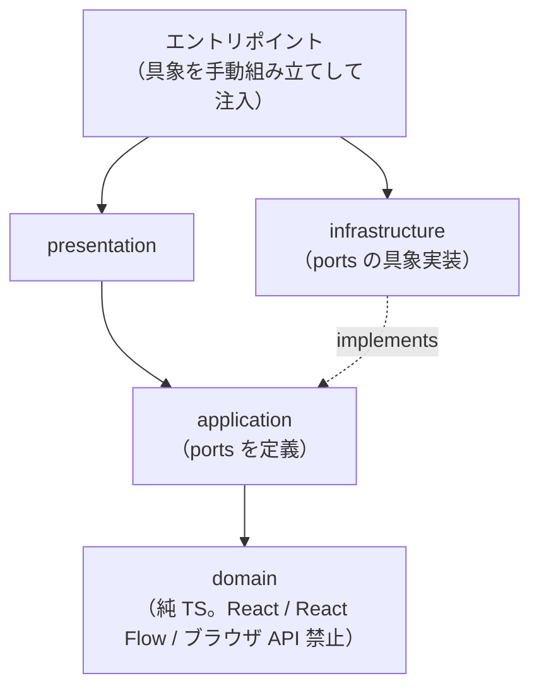

# GOOYA Canvas 技術仕様書

本書は GOOYA Canvas の技術選択・実行/配備構成・モジュール境界・依存方向・横断的制約を定義する永続的ドキュメントである。
ユーザー価値・スコープは `docs/product-requirements.md`（FR / NFR の各 ID）を、レイヤー責務・ポート（interface）の定義場所・実装場所・注入方法の詳細は `docs/functional-design.md` §2 を参照する（本書では重複させない）。

---

## 1. テクノロジースタック

### 1.1 導入済み（リポジトリ実態）

| 技術 | バージョン | 役割 |
|---|---|---|
| React / react-dom | 19.2.8 | UI ライブラリ |
| TypeScript | ~6.0.2 | 型システム。`tsc -b` で型検査 |
| Vite | 8.2.2 | 開発サーバー・バンドラ |
| @vitejs/plugin-react | 6.1.0 | Vite の React 統合 |
| ESLint | 10 系 | 静的解析（typescript-eslint 8、react-hooks / react-refresh プラグイン） |

### 1.2 導入予定（選定確定・未導入）

以下は選定済みだが `package.json` には未導入。バージョンは導入時に確定し、本書へ追記する（要確認）。

| ライブラリ | 役割 |
|---|---|
| @xyflow/react | Canvas Engine（React Flow。ノード描画・接続・Zoom/Pan/Selection/MiniMap） |
| Zustand | State 管理（Domain Model を Source of Truth として一元管理） |
| zundo | Undo / Redo（Zustand middleware、FR-005） |
| Zod | プロジェクト JSON の schema validation（NFR-005） |
| Tailwind CSS | スタイリング。必要に応じて Radix UI を併用してよい（採用判断は（要確認）。特定 UI フレームワークへ強依存しない — NFR-011） |
| html-to-image | Canvas の高解像度 PNG 化（FR-016） |
| jsPDF | PDF 合成・出力（FR-017） |
| Vitest | Unit テストランナー（§6） |
| Playwright | E2E テスト（§6） |
| eslint-plugin-import | 依存方向の機械的担保（§3.2。`import/no-restricted-paths`） |

ID 採番はライブラリを使わず標準 API `crypto.randomUUID()` を用いる。

## 2. 採用したアーキテクチャ選択とその理由

| ID | 決定 | 理由 |
|---|---|---|
| AD-01 | **React + Vite の SPA。Next.js 不採用** | MVP は DB・認証・API・SSR・SEO・Server Actions・サーバーサイドデータ取得がすべて不要で、中心は Canvas 操作・state 管理・drag & drop・ブラウザ File API・Export・Prompt 生成という Client Side 処理（メモ §7）。将来 SSO・組織認証・AI API proxy・Google Drive 直接保存・プロジェクト共有・共同編集・Audit Log を実装する際にフルスタック構成を再検討する |
| AD-02 | **Canvas Engine に @xyflow/react を採用** | Node dragging / Edge connection / Zoom / Pan / Selection / Multi-selection / Viewport / MiniMap / Controls を自前実装しない（メモ §6）。GOOYA Canvas 独自機能は Custom Node として実装する |
| AD-03 | **State 管理に Zustand を採用** | nodes / edges に加え project metadata・選択状態・inspector state・prompt settings・history・dirty state を単一 store で一元管理する（メモ §6） |
| AD-04 | **Validation に Zod を採用** | 読み込んだプロジェクト JSON を必ず validate し、未知・破損・古い schemaVersion をそのまま state へ入れない（NFR-005） |
| AD-05 | **Styling に Tailwind CSS を採用** | Canvas 本体のノードは独自デザインとし、特定 UI フレームワークへ強依存しない（NFR-011）。必要に応じて Radix UI 等を利用してよい |
| AD-06 | **Export は html-to-image（PNG）+ jsPDF（PDF）** | Browser Only（NFR-001）でサーバーレンダリングを持たないため、DOM → 画像化 → PDF 合成をすべてブラウザ内で完結させる |
| AD-07 | **Undo / Redo に zundo を採用** | Zustand middleware として store の `nodes` / `edges` のみを履歴追跡でき、AD-03 と整合する（履歴対象の詳細は functional-design §11） |
| AD-08 | **ID 採番は `crypto.randomUUID()`** | Browser Only で衝突耐性のある一意 ID を依存ライブラリなしで得られる |
| AD-09 | **テストは Vitest（Unit）+ Playwright（E2E）** | Vite との親和性、および主要導線の E2E 検証（メモ §42、§6 参照） |
| AD-10 | **DI コンテナ不採用** | ポート具象はエントリポイントで手動組み立てし、application service へ引数または生成時注入で束ねる。ポート 5 種・単一エントリポイントの規模に対して DI コンテナは過剰（functional-design §2.3） |
| AD-11 | **サーバー・DB・認証を持たない Browser Only** | プロジェクトファイル `*.gooya-canvas.json` を正式な保存先とし、Workflow をサーバーへ送信しない（NFR-001、メモ §39） |
| AD-12 | **デプロイ先は GitHub Pages（github.io）** | サーバーサイド処理のない静的 SPA（AD-01, AD-11）に十分で、GitHub Actions による build → deploy の自動化と整合する。リポジトリ名サブパス配信のため Vite の `base` 設定が必要（§4） |

## 3. アーキテクチャ原則とその担保

ドメイン駆動 × レイヤード（モジュラモノリス）を採用する。原則の宣言に留めず、以下の機械的担保と規約で維持する。

### 3.1 モジュール境界と依存方向

- モジュールは `workflow`（コアドメイン・純 TypeScript）/ `canvas` / `inspector` / `project` / `export` / `prompt` / `review` / `shared` の 8 つ（各モジュールの責務は functional-design §2.1 が所有）。
- 各モジュール内のレイヤー依存は一方向 `presentation → application → domain` に限定し、infrastructure は application が定義するポートを実装する（DIP。ポート 5 種の定義・実装・注入は functional-design §2.3 が所有）。
- モジュール間は他モジュールの内部実装を直接 import しない。共有は `workflow`（Domain Model）または `shared` を経由する。



### 3.2 依存方向の機械的担保（ESLint import 制約）

`eslint-plugin-import` の `import/no-restricted-paths`（zones）を導入し、CI 前提の `npm run lint` で以下を強制する（プラグインは導入予定 — §1.2）。

| 制約 | 内容 |
|---|---|
| domain 最内層 | `src/modules/*/domain/**` から `application` / `presentation` / `infrastructure` / React / `@xyflow/react` / ブラウザ API ラッパへの import を禁止 |
| application の DIP | `src/modules/*/application/**` から `infrastructure` / `presentation` への import を禁止（infrastructure 具象はエントリポイントのみが import できる） |
| 逆流禁止 | `application` → `presentation`、`domain` → 上位レイヤーの import を禁止 |
| モジュール間境界 | `src/modules/<A>/**` から `src/modules/<B>/**` の内部（`workflow` の公開 API と `shared` を除く）への import を禁止 |
| React Flow の封じ込め | `@xyflow/react` の import を `src/modules/canvas/**` 以外で禁止 |

具体的な zones 設定（グロブ）は `eslint.config.js` に記述し、配置規則の詳細は `repository-structure.md` が所有する。

### 3.3 外部 SDK 型の境界規約

- **Source of Truth は Zustand store が保持する Domain Model**。@xyflow/react の `Node` / `Edge` 型は `canvas` モジュール内の mapper（`toReactFlow` / `fromReactFlow`）でのみ相互変換し、store・domain・application の公開シグネチャに React Flow 型を出さない（NFR-010、functional-design §2.4）。
- infrastructure の具象（Blob / File Picker / Clipboard / localStorage / html-to-image / jsPDF）が返す値は、ポートのシグネチャが定める型（`string` / `Blob` / ドメイン型）へ境界内で変換してから返す。ライブラリ固有の型・例外をポートの外へ漏らさない。

### 3.4 純粋性の担保

- `workflow` ドメイン（型・Zod スキーマ・接続ルール・migration レジストリ）は React / @xyflow/react / ブラウザ API に一切依存しない純粋 TypeScript とする。migration は純関数の連鎖（現行 schemaVersion "1.0"、より新しいバージョンのファイルは開かない — functional-design §7.4）。
- Prompt Generator と Flow Review は Domain Model のみを入力とする**決定論的純関数**とする（FR-019, FR-023）。同一入力から常に同一出力が得られることを Unit テストの前提とする（§6）。

## 4. 実行・配備構成

- **実行**: すべての処理（編集・保存・読込・Export・Prompt 生成・Review）をブラウザ内で完結する SPA。バックエンド・HTTP 通信を持たない（システム構成図は functional-design §1）。
- **ルーティング**: 画面は 1 つ（Editor + Modal/Drawer）であり、クライアントルーターは導入しない（functional-design §4.4）。
- **ビルド**: `tsc -b && vite build` により `dist/` へ静的成果物を出力する。
- **配備**: 静的ホスティングは **GitHub Pages** を採用する（AD-12。`https://<org>.github.io/gooya-canvas/` 想定）。サーバーサイド処理は不要で、SPA fallback 設定も不要（単一ページのため）。
  - GitHub Pages はリポジトリ名のサブパスで配信されるため、Vite の `base` 設定（例: `/gooya-canvas/`）が必要。
  - デプロイは GitHub Actions で build → Pages へ deploy する（具体的なワークフロー定義は実装時に確定する）。
  - 前提: 現状 git 未初期化のため、リポジトリの git 初期化と GitHub リポジトリ作成が先行する（§5.2 参照）。
- **外部配信リソース**: 外部フォント・外部スクリプトの読込は行わず、System Font と Bundled Icons を使用する（NFR-004）。サンプルプロジェクトもアプリにバンドルする。

## 5. 開発ツールとコマンド

### 5.1 現状の npm scripts

| コマンド | 内容 |
|---|---|
| `npm run dev` | Vite 開発サーバー起動 |
| `npm run build` | `tsc -b && vite build`（型検査 + 本番ビルド） |
| `npm run lint` | `eslint .` |
| `npm run preview` | ビルド成果物のローカル確認 |

### 5.2 導入予定

| コマンド（予定） | 内容 |
|---|---|
| `npm run test` | Vitest による Unit テスト（導入予定） |
| `npm run test:e2e` | Playwright による E2E テスト（導入予定） |
| フォーマッタ | 未設定。Prettier 等の採用は（要確認）— 確定後は `development-guidelines.md` が規約を所有する |

git は未初期化のため、開発開始時に初期化する（Git 規約は `development-guidelines.md` が所有）。

## 6. テスト戦略

Canvas UI のテストより **Domain Model / Generator / Validator の Unit テストを重視**する（メモ §42）。

### 6.1 Unit テスト（Vitest）

重点対象:

- Workflow Schema（Zod validation の受理・拒否）
- Project serialization / deserialization（保存 → 読込で Node 位置・Edge・設定が一致すること）
- Schema migration（レジストリの純関数連鎖。新しい schemaVersion の拒否を含む）
- Prompt generation（決定論的出力のスナップショット・分岐反映）
- Flow validation（Review ルール RV-E / RV-W / RV-I の検出）

これらはすべて純関数（§3.4）であり、DOM・ブラウザ API のモックなしでテストできる構造を維持する。

### 6.2 E2E テスト（Playwright）

主要導線 1 本を最優先で検証する:

```text
New Project → Add Nodes → Connect → Edit → Save → Open → Generate Prompt
```

Canvas 操作の網羅的な E2E は行わず、受け入れ条件（AC）のうちファイル入出力・Export・Prompt コピーなどブラウザ統合が必要なものに絞る。

## 7. 技術的制約と要件（横断的制約）

- **Browser Only**: Workflow をサーバーへ送信しない。MVP に外部システムとの通信は存在しない（NFR-001）。
- **秘密情報の排除**: Workflow（config 含む）へ実際の API Key・Password・Access Token・Webhook Secret を保存させない。「Authentication: OAuth required」等の設計情報のみ保持する（NFR-002）。
- **LLM API キーのハードコード禁止**: MVP は AI API なしで価値が成立する構造とする。将来導入時は BYOK / 社内 API Gateway / Azure OpenAI / OpenAI API Proxy 等を別途検討する（NFR-003、メモ §29）。
- **外部リソース最小化**: System Font / Bundled Icons を利用し、外部フォント・外部スクリプトを必要最低限とする（NFR-004）。
- **データ互換性**: プロジェクトファイルは schemaVersion を必ず持ち、前方 migration（1.0 → 1.1）を可能とする。現行版より新しい schemaVersion のファイルは開かない（NFR-008）。
- **localStorage の用途限定**: Crash Recovery 専用とし、正式な保存先として扱わない（NFR-006）。
- **実行環境**: デスクトップブラウザ前提。モバイル対応は要求されていない。対応ブラウザの具体的な範囲は（要確認）（NFR-009）。

## 8. パフォーマンス要件

- 具体的な数値目標（扱えるノード数の上限・Export 解像度・応答時間など）は（要確認）— 初期要求メモに数値定義がない（NFR-012）。
- 現時点で確定している要求は次の 2 点のみ: PNG / PDF Export が**高解像度**であること、Export 対象が Viewport の可視範囲ではなく全 Node / Edge の Bounding Box であり **Canvas の端が切れない**こと（FR-016, AC-019）。
- 数値目標が確定した時点で本節を更新し、必要なら仮想化・分割 Export（MVP 後の拡張候補（development-roadmap §4）の PDF 複数ページ分割等）を検討する。

---

## 付記: 本書の情報源

初期要求メモ `docs/ideas/initial-requirements.md` §6・§7・§29・§37〜§39・§42・§43、`docs/product-requirements.md` の FR / NFR、`docs/functional-design.md` §2、およびリポジトリ実態（package.json / npm scripts）に基づく。
