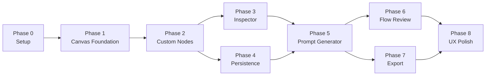

# GOOYA Canvas 開発工程（Development Roadmap）

本書はフェーズ・実行順・完了条件・主要依存を定義する永続的ドキュメントである。個別タスクの進捗は書かない。

- 完了条件は `docs/product-requirements.md` の AC / FR の ID 参照で示し、文言を再記述しない。
- 用語は英語表記を正とする（`docs/glossary.md` 参照）。
- フェーズ骨格は初期要求メモ §43（Phase 0〜8）に基づき、セットアップ・デプロイタスク（AD-12 ほか）を織り込んでいる。
- 注意: 本書の「Phase 2」は**実装フェーズ**（Custom Nodes）を指す。MVP 後の拡張候補群（§4）は実装フェーズの Phase 2 とは別概念であり、混同しないこと。

---

## 1. フェーズ一覧と実行順

Phase 0 → 8 の順に実装する。並行可否は §2 を参照。

### Phase 0 — Project Setup

リポジトリ・パイプライン・依存ライブラリの整備。**初手の順序は次で確定**している（development-guidelines §6、architecture §4）。

1. `git init` → 初回コミット
2. GitHub リポジトリ `gooya-canvas` 作成・push
3. `.github/workflows/` 追加（GitHub Actions → GitHub Pages デプロイ、AD-12）
4. Vite `base: '/gooya-canvas/'` 設定

あわせて以下をセットアップタスクとして計上する（architecture §1.2）。

- ランタイム依存: @xyflow/react / Zustand / zundo / Zod / Tailwind CSS / html-to-image / jsPDF
- 開発依存: Prettier + eslint-config-prettier / Vitest / Playwright / eslint-plugin-import（`import/no-restricted-paths` zones — architecture §3.2）
- ディレクトリ骨格: `src/app/` + `src/modules/`（shared を含む 8 モジュール。repository-structure §2 参照）

**完了条件**: `npm run build` / `npm run lint` が通り、GitHub Pages でビルド成果物が配信されること。ESLint の依存方向 zones が有効であること。

### Phase 1 — Canvas Foundation

React Flow 配置、Node 追加・移動・削除、Edge 接続・削除、Zoom / Pan、MiniMap。

**完了条件**: AC-001, AC-002, AC-003, AC-004, AC-005, AC-007, AC-008, AC-009（FR-002, FR-003）

### Phase 2 — Custom Nodes

11 種の Node Type（FR-001）の Custom Node 実装と、Node Type に応じた接続ルール。

**完了条件**: FR-001, FR-007, FR-008 を満たすこと（初期要求メモ §43 は 8 種のみ列挙しているが、FR-001 の 11 種を正とする）

### Phase 3 — Inspector

Node Type ごとの設定 UI（Inspector）と Edge 設定。

**完了条件**: AC-010, AC-011（FR-009, FR-010）

### Phase 4 — Project Persistence

Save Project / Open Project、Zod validation、Schema Migration、New Project、サンプルプロジェクト（Interview Evaluation Reminder）。

**完了条件**: AC-012, AC-013, AC-014, AC-015（FR-011, FR-012, FR-013, FR-014, FR-015）

### Phase 5 — Prompt Generator

Workflow Domain Model → Markdown の決定論的生成、Prompt Panel、Implementation Target 選択。

**完了条件**: AC-020, AC-021, AC-022, AC-023（FR-019, FR-020, FR-021, FR-022）

**E2E 整備をこのフェーズに紐づける**: 主要導線 `New Project → Add Nodes → Connect → Edit → Save → Open → Generate Prompt` を構成する機能群が Phase 5 完了時点で揃うため、Playwright による E2E（`e2e/mainFlow.spec.ts`）をここで整備する。以降、この導線が通ることを **main マージの継続条件**とする（development-guidelines §5.2）。Playwright 自体の導入は Phase 0 で済ませておく。

### Phase 6 — Flow Review

Rule-based validation（ERROR / WARNING / INFO）と Review UI（該当 Node へのジャンプ）。

**完了条件**: AC-024, AC-025, AC-026, AC-027, AC-028（FR-023, FR-024）

### Phase 7 — Export

PNG / PDF 出力（html-to-image + jsPDF、AD-06）。

**完了条件**: AC-016, AC-017, AC-018, AC-019（FR-016, FR-017, FR-018）

### Phase 8 — UX Polish

Undo / Redo（zundo、AD-07）、Keyboard Shortcuts、Context Menu、Copy / Paste、Snap to Grid、Dirty Indicator。

**完了条件**: FR-004, FR-005, FR-006 を満たすこと（AC-006 の複製導線を含む）。localStorage による Crash Recovery（NFR-006）は任意実装であり、本フェーズの完了条件に含めない。

## 2. フェーズ間の主要依存

- Phase 4（Persistence）と Phase 3（Inspector）はいずれも Phase 2 の Domain Model（Node Type・config）に依存するが、相互には独立しており並行着手できる。
- Phase 6（Flow Review）と Phase 7（Export）は相互に独立しており、Phase 5 以降であれば順序を入れ替えてよい（メモ §43 の既定順は Review → Export）。
- Prompt Generator / Flow Review / Persistence はすべて Workflow Domain Model のみを入力とする（NFR-010、architecture §3.4）。UI フェーズの遅延がこれらの Unit テスト整備を妨げない構造を保つ。
- Unit テスト（Vitest）はフェーズ横断で随時追加する。重点対象と優先順は development-guidelines §5.1 に従う。

## 3. MVP 完了の定義

初期要求メモ §41（MVP Acceptance Criteria）に対応する **AC-001〜AC-028（product-requirements §7）をすべて満たした状態**を MVP 完了とする。あわせて次を満たすこと。

- 外部 LLM API なしで Prompt 生成・Review が成立している（NFR-003）
- 主要導線の E2E が main で継続的に通っている（§1 Phase 5）
- GitHub Pages 上で最新の main が配信されている（AD-12）

## 4. MVP 後の拡張候補

MVP 完了後の候補群。着手順序・採否は未確定（要確認）。名称は glossary の定義に従う。

| 候補 | 概要の所有 | 前提・依存 |
|---|---|---|
| AI Draft | glossary / メモ §28 | 外部 LLM 連携の方式決定（BYOK / 社内 API Gateway 等 — NFR-003）が先行 |
| AI Review | glossary / メモ §28 | 同上。Rule-based Review（Phase 6）の上に追加する |
| AI Enhance Prompt | glossary / メモ §28 | 同上。決定論的 Generator（Phase 5）を置き換えず補強する |
| Auto Layout（Tidy Flow） | glossary / メモ §34 | ELK.js 等の選定（要確認） |
| Swimlane | glossary / メモ §35 | schemaVersion migration（FR-014）を伴う可能性 |
| Template | glossary / メモ §36 | 通常の `.gooya-canvas.json` として管理。Persistence（Phase 4）の機構をそのまま使う |
| PDF 複数ページ分割 | glossary / メモ §21 | Export（Phase 7）の拡張。性能目標の確定（NFR-012）と併せて検討 |

SSO・組織認証・AI API proxy・Google Drive 直接保存・プロジェクト共有・共同編集・Audit Log に着手する時点で、フルスタック構成（Next.js 等）の再検討を行う（AD-01、product-requirements §5）。

## 5. 未確定事項

- 納期・リリース時期・マイルストーン日付: （要確認）— product-requirements §5 と同様、情報源に定義がない。本書は実行順のみを確定する。
- MVP 後の拡張候補の優先順位・採否: （要確認）
- 性能目標（NFR-012）確定時の対応フェーズ: （要確認）— 確定内容によっては Phase 7 の完了条件へ追記する。

---

## 付記: 本書の情報源

初期要求メモ `docs/ideas/initial-requirements.md` §4・§21・§28・§34〜36・§41〜43、`docs/product-requirements.md`（AC / FR / NFR）、`docs/architecture.md`（AD-01, AD-06, AD-07, AD-12、§1.2・§3・§6）、`docs/development-guidelines.md` §5〜§6、`docs/glossary.md` に基づく。
