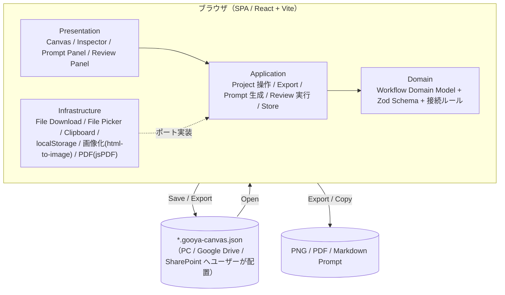
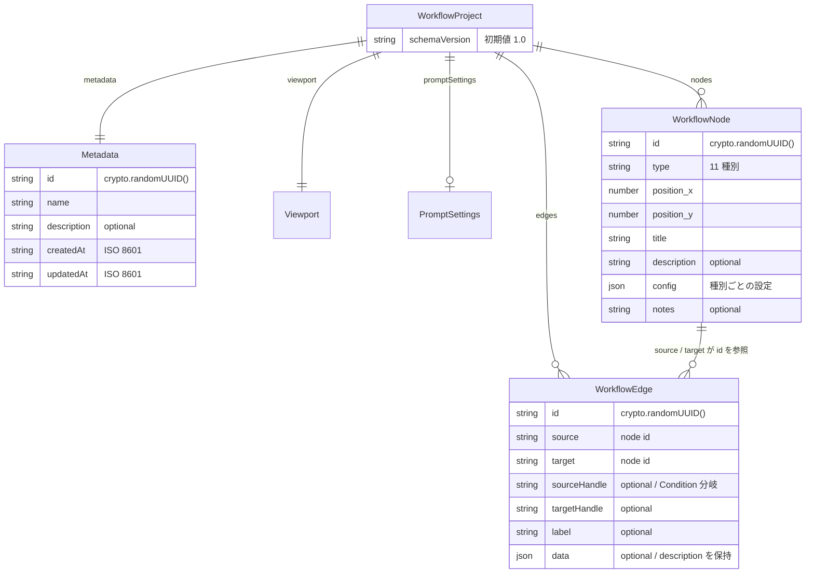
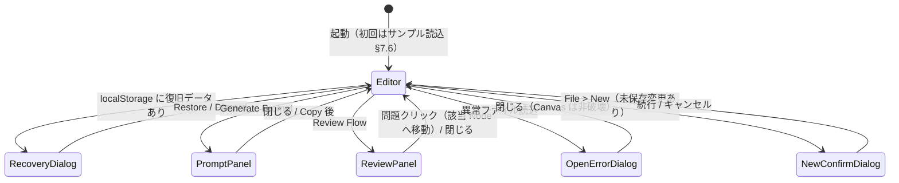
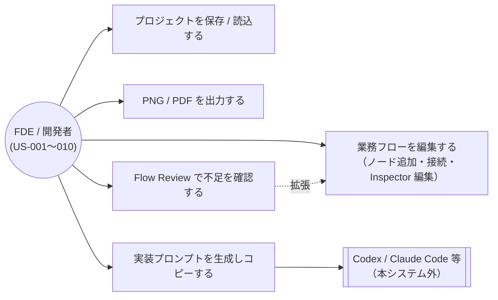

# GOOYA Canvas 機能設計書

本書は GOOYA Canvas の「どう振る舞うか」を定義する永続的ドキュメントである。
ユーザー価値・スコープ・受け入れ条件は `docs/product-requirements.md`（FR / NFR / US / AC の各 ID）を、
技術選択の理由・横断的制約は `architecture.md` を参照する。本書は要求 ID を併記してトレーサビリティを示す。

---

## 1. システム構成図

サーバー・DB・認証を持たない Browser Only の SPA である（NFR-001）。永続化はユーザー自身によるファイルダウンロード / ファイルオープンで行い、localStorage は Crash Recovery 限定で使う（NFR-006）。



外部システムとの通信は存在しない。外部 LLM API も MVP では使用しない（FR-019, NFR-003）。

## 2. ドメイン分割とレイヤー責務

### 2.1 境界づけられたコンテキスト（モジュール）

| モジュール | 責務（単一責任） | 主な成果物 |
|---|---|---|
| `workflow`（コアドメイン） | Workflow Domain Model（型・Zod スキーマ・schemaVersion / migration・ノード種別カタログ・接続ルール）。React / @xyflow/react に一切依存しない純粋 TypeScript | `WorkflowProject` ほか本書 §3 の型、`connectionRules`、`migrations` |
| `canvas` | React Flow による描画と操作（Palette / Custom Node / Context Menu / ショートカット）。React Flow 型 ↔ Domain 型の相互変換 | `WorkflowCanvas`、`NodePalette`、mapper（`toReactFlow` / `fromReactFlow*` / `mergeReactFlow*`。§2.4） |
| `inspector` | 選択中 Node / Edge の設定編集 UI | `Inspector` と Node Type 別フォーム |
| `project` | 新規作成 / 保存 / 読込 / dirty 管理 / Crash Recovery のユースケース | save / open / recover の application service |
| `export` | Canvas 全体の PNG / PDF 出力ユースケース | `exportPng`, `exportPdf` |
| `prompt` | Domain Model → Markdown Prompt の決定論的生成と Prompt Panel | `generatePrompt`, `PromptPanel` |
| `review` | Domain Model の Rule-based 解析と Review Panel | `reviewWorkflow`, `ReviewPanel` |
| `shared` | 複数モジュール共有の UI 部品・ユーティリティ・store 基盤 | Zustand store、共通 UI |

各モジュールは他モジュールの内部実装を直接 import しない。共有が必要な型・部品は `workflow`（Domain Model）または `shared` を経由する。

### 2.2 レイヤーと依存方向

依存は一方向 `presentation → application → domain` に限定する。infrastructure は application が定義するポートを実装し、上位へは依存しない（依存性逆転）。

| レイヤー | 責務 | 禁止事項 |
|---|---|---|
| presentation | React コンポーネント。store の購読とユースケース呼び出しのみ | ビジネスロジック（接続判定・Review ルール・Prompt 生成）を持たない |
| application | ユースケース（保存・読込・Export・Prompt・Review）と Zustand store。ポート（interface）の定義 | ブラウザ API・外部ライブラリ具象への直接依存 |
| domain | Workflow Domain Model・Zod スキーマ・migration・接続ルール。純関数のみ | React / @xyflow/react / ブラウザ API への依存 |
| infrastructure | ポートの具象実装（Blob download、File Picker、Clipboard、localStorage、html-to-image、jsPDF） | ドメインロジックの保持 |

### 2.3 ポートの定義場所・実装場所・注入方法

| ポート（interface） | 定義場所 | 実装場所（具象） | 用途 |
|---|---|---|---|
| `ProjectFilePort`（`download(name, json)` / `pickAndRead(): Promise<string>`） | `project` の application/ports | infrastructure（Blob + `<a download>` / `<input type="file">`） | 保存・読込（FR-012, FR-013） |
| `RecoveryStoragePort`（`save` / `load` / `clear`） | `project` の application/ports | infrastructure（localStorage） | Crash Recovery（NFR-006） |
| `CanvasImagePort`（`capture(bounds, options): Promise<Blob>`） | `export` の application/ports | infrastructure（html-to-image） | PNG / PDF の元画像（FR-016） |
| `PdfComposerPort`（`compose(image, meta): Promise<Blob>`） | `export` の application/ports | infrastructure（jsPDF） | PDF 出力（FR-017） |
| `ClipboardPort`（`copy(text)`） | `prompt` の application/ports | infrastructure（Clipboard API） | Prompt コピー（AC-023） |

具象実装はアプリ起動時（エントリポイント）に組み立て、application service へ引数または生成時注入で束ねる。DI コンテナは導入しない（規模に対して過剰なため）。

### 2.4 Canvas UI と Domain Model の分離規約（NFR-010）

- **Source of Truth は Zustand store が保持する Domain Model**（`WorkflowNode[]` / `WorkflowEdge[]` / metadata / promptSettings）とする。
- @xyflow/react の `Node` / `Edge` 型は `canvas` モジュール内の mapper でのみ扱い、**store・domain・application の公開シグネチャに React Flow 型を出さない**。mapper の関数構成は次の 3 系統とする。

| 関数 | 方向 | 役割 |
|---|---|---|
| `toReactFlow(graph)` | Domain → React Flow | Domain Model から React Flow の `nodes` / `edges` を生成する |
| `fromReactFlowConnection` / `fromReactFlowPosition` / `fromReactFlowIds` | React Flow → Domain | 接続・座標・選択/削除対象 ID を Domain 値へ変換する（`fromReactFlow` という単一関数は置かない。React Flow のイベントは種類ごとに必要な情報が異なるため） |
| `mergeReactFlowNodes` / `mergeReactFlowEdges` | Domain の変更 → 既存 React Flow 配列 | Domain の変更を既存配列へマージする。**変化のない要素は同一参照を維持し、配列全体に変化が無ければ配列そのものも同一参照を返す** |

- **controlled flow の要点**: React Flow は `measured`（測定済みサイズ）や `selected` を、props で渡したノード／エッジ**オブジェクト自身**に保持する。そのため Domain の変更ごとに配列を作り直すと MiniMap が描画されないなどの不整合が起きる。これを避けるため、(a) Domain → React Flow の同期は store の `subscribe` で購読し `mergeReactFlow*` を通して適用する、(b) `onNodesChange` の `dimensions` 変更を `applyNodeChanges` で適用しないと `measured` が付かないため、同 handler で必ず適用する。
- JSON 保存・Prompt 生成・Flow Review はすべて Domain Model を入力とし、React Flow の内部状態を直接読まない。
- store が持つ UI 状態: `viewport` / `isDirty` / inspector・panel の開閉状態 / prompt settings。Undo / Redo 履歴は zundo で Node / Edge 配列のみを対象にする（§11）。
- **dirty 判定規則**: `isDirty` を立てるのは `nodes` / `edges` / `metadata` / `promptSettings` の変更である。**`viewport` の変更と選択状態の変更では立てない**（Pan / Zoom のたびに未保存インジケータが点くのを避けるため。Viewport を Undo 履歴の対象外とする §11 の方針と一貫する）。`isDirty` を倒すのは、正式保存の成功時（§7.2）と、New / Open / Crash Recovery による store 復元時（§7.1 / §7.3 / §7.5）である。
- **選択状態（選択中の Node / Edge）の所有者**: 選択状態は Domain Model ではないため store には持たせない。**Phase 1 は `canvas` の presentation（`WorkflowCanvas`）が React Flow の `nodes` / `edges` 配列上（各要素の `selected`）に保持する**。Inspector が選択ノードを参照する必要が生じる **Phase 3 で `shared` の store へ移す**（`selectedNodeIds` / `selectedEdgeId` として保持し、presentation は store を購読する）。移行時も React Flow 型は store へ出さず、ID のみを保持する。

## 3. データモデル定義

### 3.1 ER 図



### 3.2 TypeScript 型定義

`workflow` ドメインが所有する。全 ID は `crypto.randomUUID()` で採番する。

```ts
type WorkflowNodeKind =
  | "trigger" | "dataSource" | "action" | "condition" | "wait"
  | "humanTask" | "notification" | "ai" | "integration" | "end" | "note";

type PromptTarget =
  | "generic" | "google-apps-script" | "power-automate"
  | "cloudflare" | "azure" | "web-application" | "other";

type WorkflowProject = {
  schemaVersion: string; // 現行 "1.0"
  metadata: {
    id: string;
    name: string;
    description?: string;
    createdAt: string; // ISO 8601
    updatedAt: string; // ISO 8601
  };
  viewport: { x: number; y: number; zoom: number };
  nodes: WorkflowNode[];
  edges: WorkflowEdge[];
  promptSettings?: {
    target?: PromptTarget;
    language?: "ja" | "en";
    additionalInstructions?: string;
  };
};

type WorkflowNode = {
  id: string;
  type: WorkflowNodeKind;
  position: { x: number; y: number };
  data: {
    title: string;
    description?: string;
    config: Record<string, unknown>; // 種別ごとの設定（§3.3）
    notes?: string;
  };
};

type WorkflowEdge = {
  id: string;
  source: string;
  target: string;
  sourceHandle?: string; // Condition の分岐識別に使用
  targetHandle?: string;
  label?: string; // Yes / No / Completed / Pending 等
  data?: { description?: string };
};
```

上記と同形の Zod スキーマを `workflow` ドメインに定義し、保存時・読込時の validation に用いる（FR-012, FR-013, NFR-005）。`config` はスキーマ上 `Record<string, unknown>` として受け、種別ごとの推奨キー（§3.3）は Inspector と Review が解釈する（未知キーを持つファイルも読める後方互換のため）。

### 3.3 Node Type 別の config 推奨キー

| 種別 | 推奨キー | 備考 |
|---|---|---|
| trigger | `system`（Calendar Event / Schedule / Form Submitted / File Created / Manual Trigger / API Event 等）、`event` | `system` 未設定は Review WARNING（§10） |
| dataSource | `provider`（Google Sheets / Excel / Salesforce / HRMOS / BigQuery / SharePoint / Database / API 等） | |
| action | `operation`（データ取得 / 更新 / 集計 / ファイル生成 / API 呼び出し 等） | |
| condition | `branches: string[]`（初期値 `["Yes", "No"]`、ユーザーが変更可能） | 分岐は sourceHandle と対応（FR-010） |
| wait | `duration: number`、`unit`（minutes / hours 等）、`until`（"09:00" / "Next business day" 等） | 設計情報として保持。スケジューラは実装しない |
| humanTask | `role`、`action`、`expectedResult` | |
| notification | `provider`（Microsoft Teams / Email / Slack / Other）、`recipient`、`message`、`purpose` | |
| ai | `task`（Summarize / Classify / Extract / Generate / Evaluate 等）、`input`、`expectedOutput`、`constraints` | 特定 AI Provider に依存させない（NFR-011） |
| integration | `system`（REST API / Webhook / Microsoft Graph / Google API / Salesforce API 等） | |
| end | `outcome`（Completed / Cancelled / Failed / No Action） | |
| note | なし（`title` / `notes` のみ使用） | Prompt へコメントとして出力可能（FR-022） |

セキュリティ規約: config へ実際の API Key・Password・Access Token・Webhook Secret を保存させない。「Authentication: OAuth required」のような設計情報のみを保持する（NFR-002）。Inspector にその旨の注意書きを表示する。

## 4. 画面設計

### 4.1 画面レイアウト（ワイヤーフレーム）

単一画面のデスクトップ向け 3 ペイン構成 + ヘッダ + ステータスバー。

```text
┌─────────────────────────────────────────────────────────────┐
│ GOOYA Canvas     File  Edit  View       Review  Prompt      │  ← Header
├────────────┬───────────────────────────────┬────────────────┤
│ Node       │                               │ Inspector      │
│ Palette    │        Workflow Canvas        │  Name          │
│  Trigger   │   （Grid / MiniMap /          │  Description   │
│  Data      │     Controls / Selection）    │  Node Type     │
│  Action    │                               │  Notes         │
│  Condition │                               │  ─ 種別別設定 ─ │
│  Wait      │                               │                │
│  Human     │                               │                │
│  Notify    │                               │                │
│  AI        │                               │                │
│  Integr.   │                               │                │
│  End       │                               │                │
│  Note      │                               │                │
├────────────┴───────────────────────────────┴────────────────┤
│ Status / validation（dirty 状態・Review サマリ）             │  ← Status Bar
└─────────────────────────────────────────────────────────────┘
```

### 4.2 Header メニュー

| メニュー | 項目 | 対応要求 |
|---|---|---|
| File | New / Open Project / Save Project / Export PDF / Export PNG | FR-011〜013, FR-016, FR-017 |
| Edit | Undo / Redo / Delete / Duplicate | FR-005, FR-002 |
| View | Fit View / Zoom In / Zoom Out | FR-003 |
| Main Actions | Review Flow / Generate Prompt | FR-019, FR-023 |

### 4.3 ステータスバー

- dirty 状態（未保存変更あり）のインジケータを表示する。
- 直近の Flow Review 実行結果のサマリ（`2 Errors / 4 Warnings / 3 Suggestions` 形式）を表示する。
- その他の表示項目（ズーム率・ノード数など）: （要確認）— 初期要求メモは「Status / validation」とのみ定義。

### 4.4 画面遷移図

画面は 1 つで、Modal / Drawer / Dialog がその上に開閉する。



### 4.5 ユースケース図



## 5. Canvas 編集機能

### 5.1 ノード操作（FR-001, FR-002, FR-004）

本節は MVP 完成時点の仕様である。フェーズ差のある項目には担当フェーズを注記する（フェーズ定義は `docs/development-roadmap.md`）。

- **追加**: Node Palette から Canvas へドラッグ&ドロップで追加する。追加時に種別ごとの既定 `title` と初期 `config`（§3.3。Condition は `branches: ["Yes", "No"]`）を設定する。**種別ごとの初期 `config` の設定は Phase 2〜3**（Phase 1 は全種別 `config: {}` で追加する）。
- **移動 / 選択**: ドラッグ移動、クリック選択、Selection Rectangle と Shift クリックによる複数選択。移動時は Snap to Grid を有効にする（**Snap to Grid は Phase 8**。Phase 1 では無効）。選択状態の保持場所は §2.4 を参照。
- **削除**: 選択中の Node / Edge を Delete キー・Edit メニュー・Context Menu から削除する。Node 削除時は接続されている Edge も削除する。
- **複製**: Ctrl+D / Context Menu。複製ノードは新 ID を採番し、元ノードから少しオフセットした位置へ配置する。設定値（`data`）を引き継ぐ。
- **Copy / Paste**: Ctrl+C / Ctrl+V。選択中の Node（複数可）と、選択集合内で閉じている Edge をまとめて複製する。クリップボードはアプリ内メモリとする（OS クリップボード連携は（要確認））。
- **ノード表示**: 各ノードは icon・node type・title・short description のみ表示し、詳細は Inspector に委ねる（FR-008）。Bundled Icons を使用する（NFR-004）。**この表示仕様（Custom Node）は Phase 2**。Phase 1 は React Flow のデフォルトノードで `title` のみを表示する（mapper のシグネチャは変えず、`toReactFlow` の内部と `nodeTypes` 登録の差し替えで移行する。§2.4）。

### 5.2 接続バリデーション（FR-007）

接続試行時に以下のルールで許否を判定し、不許可の接続は作成しない。

| 種別 | incoming | outgoing |
|---|---|---|
| trigger | 0（禁止） | 複数可 |
| end | 複数可 | 0（禁止） |
| condition | 複数可 | 分岐（`branches` の数だけ Source Handle を持ち、各 Handle から 1 本以上接続可） |
| dataSource / action / wait / humanTask / notification / ai / integration | 複数可 | 複数可 |
| note | 0（禁止） | 0（禁止） |

- **note は Handle 自体を描画せず、接続を試みることもできない**。Note は設計上の補足であり Workflow 処理に参加しない（`docs/glossary.md`）ため、フローの一部として接続させない。内容は Prompt へコメントとして出力する（FR-022, §9.2）。
- 自分自身への接続（self-loop）は禁止する。
- **Cycle は禁止しない**（Retry 等の Loop が業務上あり得るため）。到達不能や終了経路の欠如は接続時ではなく Flow Review が指摘する（§10）。

### 5.3 Edge の意味づけ（FR-010）

- Edge は `label` を持てる（Yes / No / Completed / Pending / Success / Failure 等）。Canvas 上に Edge Label を表示する。
- Condition ノードからの Edge は `sourceHandle` に分岐名を保持し、接続時に分岐名を `label` の初期値とする。
- Condition の分岐名は Inspector から変更でき、変更時は該当 Edge の `sourceHandle` / `label` へ反映する。

### 5.4 Context Menu（FR-004）

Node / Edge 上の右クリックで表示する: **Edit**（Inspector へフォーカス）/ **Duplicate** / **Delete**。

### 5.5 キーボードショートカット（FR-006）

| キー | 動作 |
|---|---|
| Delete | 選択中の Node / Edge を削除 |
| Ctrl+Z | Undo |
| Ctrl+Shift+Z | Redo |
| Ctrl+D | Duplicate |
| Ctrl+C / Ctrl+V | Copy / Paste |
| Ctrl+S | Save Project |
| Ctrl+O | Open Project |
| Ctrl+A | Select All |

ブラウザ標準動作と競合するもの（Ctrl+S / Ctrl+O 等）は `preventDefault` する。Input / Textarea へのフォーカス中は Canvas ショートカットを無効化する（テキスト編集を優先）。

## 6. Inspector（FR-009, AC-010, AC-011）

- Node 選択で右ペインに Inspector を表示する。共通項目: **Name（title）/ Description / Node Type（読み取り専用）/ Notes**。
- Node Type ごとの専用フォームを共通項目の下に表示する（§3.3 の config キーに対応。例: Wait は Duration + Unit、Notification は Provider / Recipient / Message / Purpose、Human Task は Role / Action / Expected Result）。
- 編集は store の Domain Model を直接更新し、**即座に Canvas の表示へ反映**する（AC-011）。編集確定単位（フィールドの blur / 入力 debounce）で Undo 履歴 1 件とする。
- Edge 選択時は Edge 用 Inspector（Label / Description）を表示する。
- 非選択時は空状態（「ノードを選択してください」等）を表示する。

## 7. プロジェクト管理

### 7.1 新規作成（FR-011）

File > New。未保存変更（dirty）がある場合は確認ダイアログを挟み、確定後に空の `WorkflowProject`（新 UUID、schemaVersion "1.0"、既定 viewport）で store を初期化する。

### 7.2 保存（FR-012, AC-012）

```text
store の Domain Model から WorkflowProject を構築（updatedAt を更新）
↓
Zod validation（失敗時は保存せずエラー表示）
↓
JSON.stringify()
↓
Blob → ProjectFilePort.download()
↓
ファイル名 {project-name}.gooya-canvas.json でダウンロード
↓
dirty フラグ解除・Crash Recovery データ削除
```

project-name はファイル名に使えない文字をサニタイズする。保存先の選択はブラウザのダウンロード機構に委ね、アプリは関与しない（ユーザーが PC / Google Drive / SharePoint へ配置する運用）。

### 7.3 読込（FR-013, FR-014, AC-013〜015, NFR-005）

```text
File Picker（ProjectFilePort.pickAndRead）
↓
File.text() → JSON.parse()
↓
Zod validation
↓
Schema Migration（schemaVersion が旧版なら現行版へ順次変換）
↓
store へ反映（既存 Canvas を置き換え）
↓
fitView()
```

- JSON.parse 失敗・validation 失敗・未知の schemaVersion の場合、**既存の Canvas 状態を一切変更せず**、エラーダイアログ「このファイルを開けませんでした。GOOYA Canvas のプロジェクトファイルか確認してください。」を表示する。
- dirty 状態で Open した場合は New と同様に確認ダイアログを挟む。
- 読込前後で Node 位置・Edge・設定が一致すること（AC-014）。

### 7.4 schemaVersion と Migration（FR-014, NFR-008）

- 現行 schemaVersion は `"1.0"`。保存時は常に現行版で書き出す。
- `workflow` ドメインに migration レジストリ（`"1.0" → "1.1"` のような純関数の連鎖）を置き、読込時に現行版まで順次適用する。MVP 時点ではレジストリは空である。
- 現行版より新しい schemaVersion のファイルは開かず、異常ファイルと同じエラー処理とする。

### 7.5 Crash Recovery（NFR-006）

- dirty 状態の間、Domain Model を debounce 付きで localStorage（`RecoveryStoragePort`）へ自動保存する（保存間隔: （要確認）— 初期要求に定義なし。既定 5 秒程度を想定）。
- 起動時に復旧データが存在すれば「Unsaved recovery data found. Restore?」ダイアログを表示し、Restore で store へ復元、Discard で削除する。
- 正式保存（§7.2）成功時と New / Open 確定時に復旧データを削除する。localStorage を正式な保存先として扱わない。

### 7.6 サンプルプロジェクト（FR-015, US-010）

初回起動時（復旧データも既存プロジェクトもない場合）に Reference Workflow「**Interview Evaluation Reminder**」を読み込んだ状態で開始する。内容:

```text
Trigger: Google Calendar 面接終了
→ Wait: 60分待機
→ Condition: 評価済み？ ─ Yes → End
                        └ No  → Notification: Teams通知
                                → Wait: 24時間待機
                                → Condition: 評価済み？ ─ Yes → End
                                                        └ No  → Notification: 再通知 → End
```

サンプルは通常の `WorkflowProject`（schemaVersion "1.0"）としてアプリにバンドルする。

## 8. Export（FR-016〜018, AC-016〜019）

### 8.1 PNG Export

```text
全 Node / Edge の Bounding Box を取得（Viewport の可視範囲ではない）
↓
Export 用表示へ切替（§8.3 の UI 要素を非表示）
↓
CanvasImagePort（html-to-image）で高解像度 PNG を生成
↓
通常表示へ復帰 → Blob をダウンロード
```

### 8.2 PDF Export

PNG と同じ画像化フローの後、`PdfComposerPort`（jsPDF）で **Canvas 全体を 1 ページに Fit** させて配置し、Project Name・Generated Date を付記してダウンロードする。巨大 Workflow の複数ページ分割は MVP 後の拡張候補（development-roadmap §4）であり、スコープ外。

### 8.3 Export 時に非表示にする UI

Handles / Selection Border / MiniMap / Controls / Inspector / Toolbar / Grid（AC-018）。

## 9. Prompt Generator（FR-019〜022, AC-020〜023）

### 9.1 生成方式

- 入力は **Domain Model（`WorkflowProject`）のみ**。React Flow の状態を読まない（NFR-010）。
- 外部 LLM API を使わず、**決定論的**に Markdown を生成する。同じ Workflow からは常に同じ Prompt が生成される（テスト容易性のため）。
- Trigger を起点に Edge を辿り、Node 順序と Condition 分岐を Prompt の手順・分岐記述へ反映する（AC-021）。Trigger が複数ある場合は各 Trigger 起点で列挙する。

### 9.2 Prompt の構成（Markdown セクション）

初期要求メモの出力例に基づく。該当データがないセクションは省略する。

| セクション | 内容の由来 |
|---|---|
| `# 実装依頼` + 導入文 | metadata.name / description |
| `## 目的` | metadata.description（未設定なら省略） |
| `## Workflow` | Trigger からの手順の番号付きリスト（分岐含む） |
| `## Trigger` | trigger ノードの config |
| `## Conditions` | condition ノードごとに分岐先を列挙 |
| `## Human Tasks` | humanTask ノードの role / action |
| `## Notifications` | notification ノードの provider / recipient / message |
| `## Constraints` | ai ノードの constraints、promptSettings.additionalInstructions |
| `## Notes` | note ノードの内容（コメントとして。FR-022） |
| `## Open Questions` | Flow Review の WARNING / INFO を未確定事項として転記 |
| `## Acceptance Criteria` | （要確認）— 出力例に含まれるが生成ロジックの定義が初期要求にない。MVP では Workflow の分岐から機械的に導出できる範囲（「〜の場合に〜される」）に留める |
| `Implementation target: <Target>` | promptSettings.target（§9.3） |

### 9.3 Prompt Panel（FR-020, FR-021）

- Generate Prompt で Drawer または Modal を開き、生成された Markdown をプレビュー表示する。
- **Target** セレクタ: Generic / Google Apps Script / Power Automate / Cloudflare / Azure / Web Application / Other の 7 種。変更すると即時再生成する。MVP では Target 別のコード生成はせず、Prompt 内へ `Implementation target: ...` を明記する程度とする。
- **Language**（promptSettings.language: ja / en）: Prompt の定型文の言語を切り替える。既定は ja。
- **Copy Prompt** ボタンで Clipboard へコピーする（AC-023）。
- Target / Language / additionalInstructions は `promptSettings` としてプロジェクトファイルに保存される。

## 10. Flow Review（FR-023, FR-024, AC-024〜028）

### 10.1 実行方式

- 入力は Domain Model のみ。Rule-based（外部 AI 不使用）で解析し、ERROR / WARNING / INFO の 3 段階で結果を返す純関数として実装する。
- Review Flow ボタンで実行し、Review Panel に件数サマリと問題一覧を表示する。ステータスバーへサマリを反映する（§4.3）。

### 10.2 ルール一覧

| ID | レベル | ルール |
|---|---|---|
| RV-E01 | ERROR | Trigger ノードが存在しない（AC-025） |
| RV-E02 | ERROR | End ノードが存在しない（AC-026） |
| RV-E03 | ERROR | どの Edge にも接続されていない Node がある（note を除く）（AC-024） |
| RV-W01 | WARNING | Condition の分岐（Source Handle）に未接続のものがある（AC-027） |
| RV-W02 | WARNING | Notification の Recipient が空 |
| RV-W03 | WARNING | Wait の Duration が未設定 |
| RV-W04 | WARNING | Human Task の Role が未設定 |
| RV-W05 | WARNING | Trigger の対象システム（config.system）が未定義 |
| RV-W06 | WARNING | Trigger から辿って End へ到達しない経路がある（終了経路が存在しない可能性） |
| RV-W07 | WARNING | Notification の後に終了条件（End への経路）が不明 |
| RV-I01 | INFO | API 失敗時の処理が定義されていない |
| RV-I02 | INFO | 重複実行対策が記載されていない |
| RV-I03 | INFO | Logging について記載がない |

RV-W02〜W05 が「必須 Node 設定の欠落」（AC-028）に対応する。RV-I01〜I03 の判定条件（何をもって「記載あり」とするか）: （要確認）— MVP では integration / action ノードや notes に該当記述がない場合に一律で表示する簡易判定とする。

### 10.3 Review UI（FR-024）

- Panel には `2 Errors / 4 Warnings / 3 Suggestions` 形式のサマリと、レベル別の問題一覧を表示する（INFO は「SUGGESTION」と表示）。
- Node に紐づく問題（対象 nodeId を持つ結果）をクリックすると、該当 Node を選択状態にして Canvas 中央へスクロール（センタリング）する。
- Review 結果は問題ごとに `{ ruleId, level, message, nodeId?, edgeId? }` の構造で保持し、Prompt Generator の Open Questions 転記（§9.2）にも同じ結果を用いる。

## 11. Undo / Redo（FR-005, US-008）

- 履歴対象: Node の追加・削除・移動・編集、Edge の追加・削除・編集。
- 履歴対象外: Viewport の Zoom / Pan、選択状態、パネル開閉、promptSettings の変更（（要確認）— promptSettings は初期要求の履歴対象一覧に含まれないため対象外とする）。
- 実装は zundo（Zustand middleware）で store の `nodes` / `edges` のみを追跡する。
- ドラッグ移動は 1 ドラッグ = 履歴 1 件、Inspector 編集は §6 の確定単位で 1 件とする。
- 履歴保持件数の上限: （要確認）— 初期要求に定義なし。

## 12. API 設計（外部契約）

- MVP にバックエンド API は存在しない。HTTP 通信を行う機能はない。
- 本システムの**外部契約はプロジェクトファイル `*.gooya-canvas.json`**（§3 の構造 + schemaVersion）である。ファイル構造の変更は schemaVersion の更新と migration の追加を伴う破壊的変更として扱う。
- 第 2 の外部契約は生成される **Markdown Prompt の構成**（§9.2）である。AI コーディングツールへの入力として利用されるため、セクション構成の変更は本書の更新を伴う。
- 将来サーバー連携（SSO・共有・AI API proxy 等）を導入する場合の API 設計は、その時点で本節へ追記する。

---

## 付記: 本書の情報源

初期要求メモ `docs/ideas/initial-requirements.md` §8〜§33・§40 に基づく。要求との対応は本文中の FR / NFR / AC / US 併記を参照。
