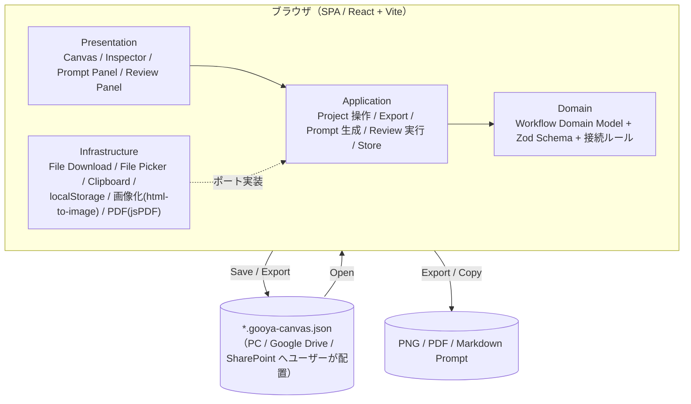
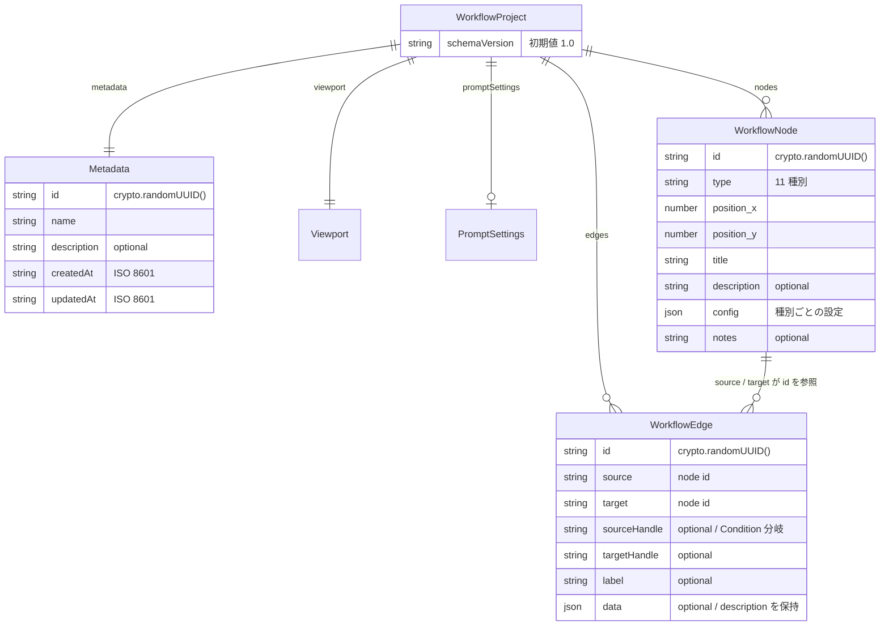
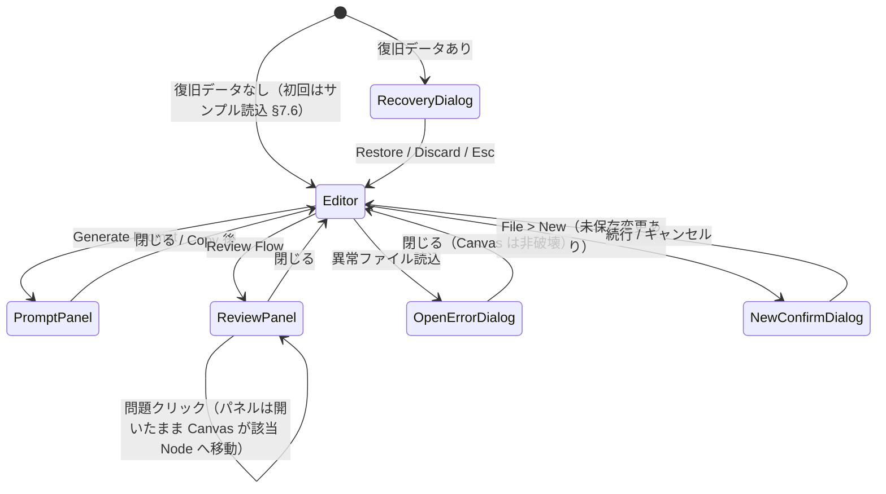
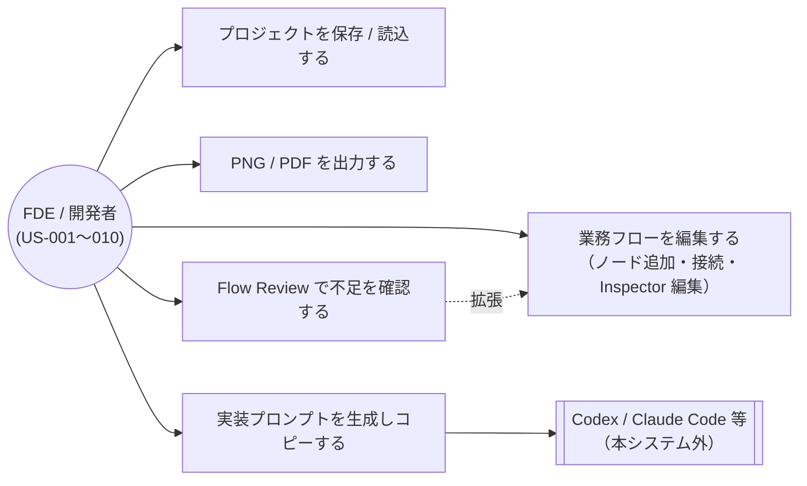

# GOOYA Canvas 機能設計書

本書は GOOYA Canvas の「どう振る舞うか」を定義する永続的ドキュメントである。
ユーザー価値・スコープ・受け入れ条件は `docs/product-requirements.md`（FR / NFR / US / AC の各 ID）を、
技術選択の理由・横断的制約は `architecture.md` を参照する。本書は要求 ID を併記してトレーサビリティを示す。

---

## 1. システム構成図

サーバー・DB・認証を持たない Browser Only の SPA である（NFR-001）。永続化はユーザー自身によるファイルダウンロード / ファイルオープンで行い、localStorage は Crash Recovery 限定で使う（NFR-006）。



外部システムとの通信は存在しない。外部 LLM API も MVP では使用しない（FR-019, NFR-003）。

## 2. ドメイン分割とレイヤー責務

### 2.1 境界づけられたコンテキスト（モジュール）

| モジュール | 責務（単一責任） | 主な成果物 |
|---|---|---|
| `workflow`（コアドメイン） | Workflow Domain Model（型・Zod スキーマ・schemaVersion / migration・ノード種別カタログ・接続ルール）。React / @xyflow/react に一切依存しない純粋 TypeScript | `WorkflowProject` ほか本書 §3 の型、`connectionRules`、`migrations` |
| `canvas` | React Flow による描画と操作（Palette / Custom Node / Context Menu / ショートカット）。React Flow 型 ↔ Domain 型の相互変換 | `WorkflowCanvas`、`NodePalette`、mapper（`toReactFlow` / `fromReactFlow*` / `mergeReactFlow*`。§2.4） |
| `inspector` | 選択中 Node / Edge の設定編集 UI | `Inspector` と Node Type 別フォーム |
| `project` | 新規作成 / 保存 / 読込 / dirty 管理 / Crash Recovery のユースケース | save / open / recover の application service |
| `export` | Canvas 全体の PNG / PDF 出力ユースケース | `exportPng`, `exportPdf` |
| `prompt` | Domain Model → Markdown Prompt の決定論的生成と Prompt Panel | `generatePrompt`, `PromptPanel` |
| `review` | Domain Model の Rule-based 解析と Review Panel | `reviewWorkflow`, `ReviewPanel` |
| `shared` | 複数モジュール共有の UI 部品・ユーティリティ・store 基盤 | Zustand store、共通 UI |

各モジュールは他モジュールの内部実装を直接 import しない。共有が必要な型・部品は `workflow`（Domain Model）または `shared` を経由する。

### 2.2 レイヤーと依存方向

依存は一方向 `presentation → application → domain` に限定する。infrastructure は application が定義するポートを実装し、上位へは依存しない（依存性逆転）。

| レイヤー | 責務 | 禁止事項 |
|---|---|---|
| presentation | React コンポーネント。store の購読とユースケース呼び出しのみ | ビジネスロジック（接続判定・Review ルール・Prompt 生成）を持たない |
| application | ユースケース（保存・読込・Export・Prompt・Review）と Zustand store。ポート（interface）の定義 | ブラウザ API・外部ライブラリ具象への直接依存 |
| domain | Workflow Domain Model・Zod スキーマ・migration・接続ルール。純関数のみ | React / @xyflow/react / ブラウザ API への依存 |
| infrastructure | ポートの具象実装（Blob download、File Picker、Clipboard、localStorage、html-to-image、jsPDF） | ドメインロジックの保持 |

application の依存に関する運用規約を 2 点補足する。

- **ブラウザ API はタイマーも注入対象とする**。`setTimeout` / `clearTimeout` 相当の遅延実行も application 内で直接呼ばず、composition root から関数として注入する。時間に依存するユースケース（自動保存の debounce。§7.5）をテストから制御できるようにするためである。
- **外部入力の検証に限り、application は Zod を直接使ってよい**。プロジェクトファイル（§7.3）や復旧データ（§7.5）のように外部から入ってきた文字列を検証するのは application のユースケースの責務であり、スキーマ定義そのものは domain が所有する（§3.2）。この用途に限って、上表の「外部ライブラリ具象への直接依存」の禁止は適用しない。検証結果として得られるのは常に Domain 型であり、Zod 固有の型を application の外へ出さない。

### 2.3 ポートの定義場所・実装場所・注入方法

| ポート（interface） | 定義場所 | 実装場所（具象） | 用途 |
|---|---|---|---|
| `ProjectFilePort`（`download(name, json)` / `pickAndRead(): Promise<string \| null>`。**`null` はキャンセルまたは読み取り不能を表す**） | `project` の application/ports | infrastructure（Blob + `<a download>` / `<input type="file">`） | 保存・読込（FR-012, FR-013） |
| `RecoveryStoragePort`（`save(json: string): void` / `load(): string \| null` / `clear(): void`） | `project` の application/ports | infrastructure（localStorage） | Crash Recovery（NFR-006） |
| `CanvasImagePort`（`capture(bounds, options): Promise<Blob \| null>`。**`null` は画像化失敗を表す**） | `export` の application/ports | infrastructure（html-to-image） | PNG / PDF の元画像（FR-016） |
| `PdfComposerPort`（`compose(image, meta): Promise<Blob \| null>`。**`null` は PDF 組版失敗を表す**） | `export` の application/ports | infrastructure（jsPDF） | PDF 出力（FR-017） |
| `CanvasSourcePort`（全 Node / Edge の Bounding Box の取得と、Export 表示への切替） | `export` の application/ports | **`canvas` モジュール**（React Flow の実測情報を持つのは canvas のみ。§8.4） | Export 対象範囲の決定と描画の切替（FR-016, AC-018） |
| `ExportFilePort`（生成された Blob のダウンロード） | `export` の application/ports | infrastructure（Blob + `<a download>`） | PNG / PDF の書き出し（FR-016, FR-017） |
| `ClipboardPort`（`copy(text)`） | `prompt` の application/ports | infrastructure（Clipboard API） | Prompt コピー（AC-023） |

`pickAndRead` がキャンセルを例外ではなく `null` として解決するのは、キャンセル時に Promise を未解決のまま放置すると読込ユースケースが永久に完了しないためである（§7.3）。**`capture` / `compose` も同じ「例外を外へ漏らさない」規約に従い、失敗を `null` として返す**。Export は Canvas を一時的に Export 用表示へ切り替えるため、例外が application を素通りすると通常表示へ復帰できないまま処理が終わる。

`RecoveryStoragePort` の**具象も例外を外へ漏らさない**。localStorage は参照自体が不可な環境（プライベートモード等）や容量超過で例外を投げるが、自動保存の失敗で編集操作が中断してはならないため、具象側で吸収し `save` / `clear` は黙って何もせず、`load` は `null` を返す。

`ExportFilePort` を `ProjectFilePort` と別に定義するのは、`ProjectFilePort` が JSON テキスト専用の契約である上に、モジュール間の直接 import を禁じている（§2.1）ため `project` のポートを `export` から使い回せないからである。

具象実装はアプリ起動時（エントリポイント）に組み立て、application service へ引数または生成時注入で束ねる。DI コンテナは導入しない（規模に対して過剰なため）。

### 2.4 Canvas UI と Domain Model の分離規約（NFR-010）

- **Source of Truth は Zustand store が保持する Domain Model**（`WorkflowNode[]` / `WorkflowEdge[]` / metadata / promptSettings）とする。
- @xyflow/react の `Node` / `Edge` 型は `canvas` モジュール内の mapper でのみ扱い、**store・domain・application の公開シグネチャに React Flow 型を出さない**。mapper の関数構成は次の 3 系統とする。

| 関数 | 方向 | 役割 |
|---|---|---|
| `toReactFlow(graph)` | Domain → React Flow | Domain Model から React Flow の `nodes` / `edges` を生成する |
| `fromReactFlowConnection` / `fromReactFlowPosition` / `fromReactFlowIds` | React Flow → Domain | 接続・座標・選択/削除対象 ID を Domain 値へ変換する（`fromReactFlow` という単一関数は置かない。React Flow のイベントは種類ごとに必要な情報が異なるため） |
| `mergeReactFlowNodes` / `mergeReactFlowEdges` | Domain の変更 → 既存 React Flow 配列 | Domain の変更を既存配列へマージする。**変化のない要素は同一参照を維持し、配列全体に変化が無ければ配列そのものも同一参照を返す** |

- **controlled flow の要点**: React Flow は `measured`（測定済みサイズ）や `selected` を、props で渡したノード／エッジ**オブジェクト自身**に保持する。そのため Domain の変更ごとに配列を作り直すと MiniMap が描画されないなどの不整合が起きる。これを避けるため、(a) Domain → React Flow の同期は store の `subscribe` で購読し `mergeReactFlow*` を通して適用する、(b) `onNodesChange` の `dimensions` 変更を `applyNodeChanges` で適用しないと `measured` が付かないため、同 handler で必ず適用する、(c) Condition の分岐（Source Handle の識別子と位置）が変化した場合は、Canvas 側から React Flow へ Handle の再計算を明示的に通知する。通知しないと Edge が旧 Handle 位置のまま描画される、(d) 起動時の全体表示（fit）は**全ノードの実測サイズが揃うまで待って**から行う。測定前に fit すると実測 0 の矩形へ合わせようとして最大倍率までズームインしてしまう、(e) **Export 表示への切替（§8.3）は React の context で全ノード／エッジへ配る**。切替フラグを各 node の `data` に載せると React Flow へ渡す配列を作り直すことになり、(b) で得た `measured` と `selected` を失うためである（(a) と同じ理由）。
- JSON 保存・Prompt 生成・Flow Review はすべて Domain Model を入力とし、React Flow の内部状態を直接読まない。
- store が持つ UI 状態: `viewport` / `isDirty` / inspector・panel の開閉状態 / prompt settings / `reviewFindings`（直近の Review 結果。§10）/ `nodeFocusRequest`（Canvas へ特定 Node へ移動させる要求。§10.3）/ `inspectorFocusRequest`（Inspector へフォーカスさせる要求。§5.4）。**後者 3 つは保存対象（`WorkflowProject`）に含めず、`isDirty` も立てず、Undo 履歴の対象外とする**（§11）。Undo / Redo 履歴は zundo で Node / Edge 配列のみを対象にする（§11）。
- **`nodes` と `edges` の双方を変える操作は、1 回の store 更新にまとめる**（Node 削除に伴う Edge 削除、Copy / Paste、Condition の分岐削除に伴う Edge 削除など）。2 回に分けると Undo 履歴も 2 件になり、ユーザーが 1 操作と認識したものを取り消すのに Ctrl+Z を 2 回要求してしまう。
- **dirty 判定規則**: `isDirty` を立てるのは `nodes` / `edges` / `metadata` / `promptSettings` の変更である。**`viewport` の変更と選択状態の変更では立てない**（Pan / Zoom のたびに未保存インジケータが点くのを避けるため。Viewport を Undo 履歴の対象外とする §11 の方針と一貫する）。`isDirty` を倒すのは、正式保存の成功時（§7.2）と、New / Open / Crash Recovery による store 復元時（§7.1 / §7.3 / §7.5）である。
- **選択状態（選択中の Node / Edge）の所有者**: 選択状態は Domain Model ではないため、保存対象（`WorkflowProject`）にも Undo 履歴にも含めない。**Phase 3 で `shared` の store へ移管済み**であり、store が `selectedNodeIds` / `selectedEdgeId` を保持し、Canvas と Inspector の双方が store を購読する（Phase 1 の暫定である「React Flow の `nodes` / `edges` 配列上の `selected` を唯一の所有者とする」方式は廃止した）。**store が持つのは ID のみで、React Flow 型は store へ出さない**。Canvas は store の選択 ID を React Flow の `selected` へ反映し、React Flow 側の選択変更は ID へ変換して store へ戻す。

## 3. データモデル定義

### 3.1 ER 図



### 3.2 TypeScript 型定義

`workflow` ドメインが所有する。全 ID は `crypto.randomUUID()` で採番する。

```ts
type WorkflowNodeKind =
  | "trigger" | "dataSource" | "action" | "condition" | "wait"
  | "humanTask" | "notification" | "ai" | "integration" | "end" | "note";

type PromptTarget =
  | "generic" | "google-apps-script" | "power-automate"
  | "cloudflare" | "azure" | "web-application" | "other";

type WorkflowProject = {
  schemaVersion: string; // 現行 "1.0"
  metadata: {
    id: string;
    name: string;
    description?: string;
    createdAt: string; // ISO 8601
    updatedAt: string; // ISO 8601
  };
  viewport: { x: number; y: number; zoom: number };
  nodes: WorkflowNode[];
  edges: WorkflowEdge[];
  promptSettings?: {
    target?: PromptTarget;
    language?: "ja" | "en";
    additionalInstructions?: string;
  };
};

type WorkflowNode = {
  id: string;
  type: WorkflowNodeKind;
  position: { x: number; y: number };
  data: {
    title: string;
    description?: string;
    config: Record<string, unknown>; // 種別ごとの設定（§3.3）
    notes?: string;
  };
};

type WorkflowEdge = {
  id: string;
  source: string;
  target: string;
  sourceHandle?: string; // Condition の分岐識別に使用
  targetHandle?: string;
  label?: string; // Yes / No / Completed / Pending 等
  data?: { description?: string };
};
```

上記と同形の Zod スキーマを `workflow` ドメインに定義し、保存時・読込時の validation に用いる（FR-012, FR-013, NFR-005）。`config` はスキーマ上 `Record<string, unknown>` として受け、種別ごとの推奨キー（§3.3）は Inspector と Review が解釈する（未知キーを持つファイルも読める後方互換のため）。

### 3.3 Node Type 別の config 推奨キー

| 種別 | 推奨キー | 備考 |
|---|---|---|
| trigger | `system`（Calendar Event / Schedule / Form Submitted / File Created / Manual Trigger / API Event 等）、`event` | `system` 未設定は Review WARNING（§10） |
| dataSource | `provider`（Google Sheets / Excel / Salesforce / HRMOS / BigQuery / SharePoint / Database / API 等） | |
| action | `operation`（データ取得 / 更新 / 集計 / ファイル生成 / API 呼び出し 等） | |
| condition | `branches: string[]`（初期値 `["Yes", "No"]`、ユーザーが変更可能） | 分岐は sourceHandle と対応（FR-010） |
| wait | `duration: number`、`unit`（minutes / hours 等）、`until`（"09:00" / "Next business day" 等） | 設計情報として保持。スケジューラは実装しない |
| humanTask | `role`、`action`、`expectedResult` | |
| notification | `provider`（Microsoft Teams / Email / Slack / Other）、`recipient`、`message`、`purpose` | |
| ai | `task`（Summarize / Classify / Extract / Generate / Evaluate 等）、`input`、`expectedOutput`、`constraints` | 特定 AI Provider に依存させない（NFR-011） |
| integration | `system`（REST API / Webhook / Microsoft Graph / Google API / Salesforce API 等） | |
| end | `outcome`（Completed / Cancelled / Failed / No Action） | |
| note | なし（`title` / `notes` のみ使用） | Prompt へコメントとして出力可能（FR-022） |

セキュリティ規約: config へ実際の API Key・Password・Access Token・Webhook Secret を保存させない。「Authentication: OAuth required」のような設計情報のみを保持する（NFR-002）。Inspector にその旨の注意書きを表示する。

## 4. 画面設計

### 4.1 画面レイアウト（ワイヤーフレーム）

単一画面のデスクトップ向け 3 ペイン構成 + ヘッダ + ステータスバー。

```text
┌─────────────────────────────────────────────────────────────┐
│ GOOYA Canvas     File  Edit  View       Review  Prompt      │  ← Header
├────────────┬───────────────────────────────┬────────────────┤
│ Node       │                               │ Inspector      │
│ Palette    │        Workflow Canvas        │  Name          │
│  Trigger   │   （Grid / MiniMap /          │  Description   │
│  Data      │     Controls / Selection）    │  Node Type     │
│  Action    │                               │  Notes         │
│  Condition │                               │  ─ 種別別設定 ─ │
│  Wait      │                               │                │
│  Human     │                               │                │
│  Notify    │                               │                │
│  AI        │                               │                │
│  Integr.   │                               │                │
│  End       │                               │                │
│  Note      │                               │                │
├────────────┴───────────────────────────────┴────────────────┤
│ Status / validation（dirty 状態・Review サマリ）             │  ← Status Bar
└─────────────────────────────────────────────────────────────┘
```

### 4.2 Header メニュー

| メニュー | 項目 | 対応要求 |
|---|---|---|
| File | New / Open Project / Save Project / Export PDF / Export PNG | FR-011〜013, FR-016, FR-017 |
| Edit | Undo / Redo / Delete / Duplicate | FR-005, FR-002 |
| View | Fit View / Zoom In / Zoom Out | FR-003 |
| Main Actions | Review Flow / Generate Prompt | FR-019, FR-023 |

### 4.3 ステータスバー

- dirty 状態（未保存変更あり）のインジケータを表示する。
- 直近の Flow Review 実行結果のサマリ（`2 Errors / 4 Warnings / 3 Suggestions` 形式）を表示する。**Review を一度も実行していない間はサマリを表示しない**（未実行と「問題 0 件」は意味が異なるため）。
- その他の表示項目（ズーム率・ノード数など）: （要確認）— 初期要求メモは「Status / validation」とのみ定義。

### 4.4 画面遷移図

画面は 1 つで、Modal / Drawer / Dialog がその上に開閉する。



### 4.5 ユースケース図



## 5. Canvas 編集機能

### 5.1 ノード操作（FR-001, FR-002, FR-004）

本節は MVP 完成時点の仕様である。フェーズ差のある項目には担当フェーズを注記する（フェーズ定義は `docs/development-roadmap.md`）。

- **追加**: Node Palette から Canvas へドラッグ&ドロップで追加する。追加時に種別ごとの既定 `title` と初期 `config`（§3.3。Condition は `branches: ["Yes", "No"]`）を設定する。**Palette からのドロップ位置はスナップしない**（本節が Snap to Grid を定めるのは「移動時」であり、ドロップ位置はユーザーがカーソルで示した位置をそのまま尊重する）。**種別ごとの初期 `config` の設定は Phase 2〜3**（Phase 1 は全種別 `config: {}` で追加する）。
- **移動 / 選択**: ドラッグ移動、クリック選択、Selection Rectangle と Shift クリックによる複数選択。移動時は Snap to Grid を有効にし、**グリッド幅は 20px** とする（Canvas に描画する格子と同じ間隔にして、目に見える線とスナップ位置を一致させるため）。選択状態の保持場所は §2.4 を参照。
- **削除**: 選択中の Node / Edge を Delete キー・Edit メニュー・Context Menu から削除する。Node 削除時は接続されている Edge も削除する（Node と Edge の変更は 1 回の更新にまとめる。§2.4）。
- **複製**: Ctrl+D / Context Menu。複製ノードは新 ID を採番し、元ノードから **(40, 40) だけオフセットした位置**へ配置する。設定値（`data`）を引き継ぐ。
- **Copy / Paste**: Ctrl+C / Ctrl+V。選択中の Node（複数可）と、選択集合内で閉じている Edge をまとめて複製する。Paste 位置は元の位置から **(40, 40) のオフセット**とし、**同一クリップボード内容を連続して Paste した場合は回数ぶんオフセットを重ねる**（同じ位置に貼り重なって見分けが付かなくなるのを避けるため）。クリップボードは**アプリ内メモリのみ**とし、**OS クリップボードとの連携は MVP ではスコープ外**（MVP 後の拡張候補。development-roadmap §4）。
- **ノード表示**: 各ノードは icon・node type・title・short description のみ表示し、詳細は Inspector に委ねる（FR-008）。Bundled Icons を使用する（NFR-004）。**この表示仕様（Custom Node）は Phase 2**。Phase 1 は React Flow のデフォルトノードで `title` のみを表示する（mapper のシグネチャは変えず、`toReactFlow` の内部と `nodeTypes` 登録の差し替えで移行する。§2.4）。

### 5.2 接続バリデーション（FR-007）

接続試行時に以下のルールで許否を判定し、不許可の接続は作成しない。

| 種別 | incoming | outgoing |
|---|---|---|
| trigger | 0（禁止） | 複数可 |
| end | 複数可 | 0（禁止） |
| condition | 複数可 | 分岐（`branches` の数だけ Source Handle を持ち、各 Handle から 1 本以上接続可） |
| dataSource / action / wait / humanTask / notification / ai / integration | 複数可 | 複数可 |
| note | 0（禁止） | 0（禁止） |

- **note は Handle 自体を描画せず、接続を試みることもできない**。Note は設計上の補足であり Workflow 処理に参加しない（`docs/glossary.md`）ため、フローの一部として接続させない。内容は Prompt へコメントとして出力する（FR-022, §9.2）。
- 自分自身への接続（self-loop）は禁止する。
- **Cycle は禁止しない**（Retry 等の Loop が業務上あり得るため）。到達不能や終了経路の欠如は接続時ではなく Flow Review が指摘する（§10）。

### 5.3 Edge の意味づけ（FR-010）

- Edge は `label` を持てる（Yes / No / Completed / Pending / Success / Failure 等）。Canvas 上に Edge Label を表示する。
- Condition ノードからの Edge は `sourceHandle` に分岐名を保持し、接続時に分岐名を `label` の初期値とする。
- Condition の分岐名は Inspector から変更でき、変更時は該当 Edge の `sourceHandle` / `label` へ反映する。
- 分岐は Inspector から**追加・削除もできる**。ただし**分岐は最低 2 つを下回れない**（Condition が分岐しないノードになるため）。**分岐名の重複は許さない**（分岐名が Source Handle の識別子を兼ねており、重複すると Edge の接続先を一意に定められないため）。
- リネーム時に Edge の `label` を追随させるのは、**`label` が旧分岐名と一致していた場合のみ**とする。ユーザーが独自に付け替えた `label` は上書きしない。
- 分岐を削除したときは、**その分岐に紐づく Edge（`sourceHandle` が当該分岐名の Edge）も併せて削除する**。参照先を失った Edge は Canvas に描画されないまま Domain Model に残り、保存内容・Prompt・Review へ紛れ込むためである。

### 5.4 Context Menu（FR-004）

Node / Edge 上の右クリックで表示する: **Edit**（Inspector へフォーカス）/ **Duplicate** / **Delete**。

- 項目は Node / Edge のいずれでも **3 つとも表示する**（位置が動くと誤操作を招くため、対象によって項目を出し入れしない）。
- ただし **Edge を対象にした場合は Duplicate を無効表示**にする。Edge 単体の複製は両端の Node を伴わずには定義できず、同じ 2 ノード間に意味のない多重 Edge を生むだけになるためである。

### 5.5 キーボードショートカット（FR-006）

| キー | 動作 |
|---|---|
| Delete / Backspace | 選択中の Node / Edge を削除 |
| Ctrl+Z | Undo |
| Ctrl+Shift+Z | Redo |
| Ctrl+D | Duplicate |
| Ctrl+C / Ctrl+V | Copy / Paste |
| Ctrl+S | Save Project |
| Ctrl+O | Open Project |
| Ctrl+A | Select All |

ブラウザ標準動作と競合するもの（Ctrl+S / Ctrl+O 等）は既定動作を抑止する。Input / Textarea へのフォーカス中は Canvas ショートカットを無効化する（テキスト編集を優先）。加えて次を定める。

- **Ctrl+S / Ctrl+O は入力欄フォーカス中も有効**とする。無効化すると抑止も行われず、ブラウザ既定の「ページを保存」「ファイルを開く」が走ってしまい、ユーザーの意図（プロジェクトの保存 / 読込）と乖離するためである。それ以外の Canvas ショートカットは入力欄フォーカス中は無効のままとする。
- **モーダルダイアログ（Recovery / New 確認 / Open エラー）表示中は全ショートカットを無効**にする。背後の Canvas がキー操作で変化すると、ダイアログの選択結果が前提としていた状態が崩れるためである。非モーダルの Review Panel / Prompt Panel は対象外で、表示中もショートカットは有効。
- **Mac の Command キーは Ctrl と同じ主修飾キーとして扱う**（表の Ctrl はいずれも Command で代替できる）。
- Delete と Backspace は同じ削除操作に割り当てる（Mac のキーボードに独立した Delete キーがない機種があるため）。

## 6. Inspector（FR-009, AC-010, AC-011）

- Node 選択で右ペインに Inspector を表示する。共通項目: **Name（title）/ Description / Node Type（読み取り専用）/ Notes**。
- Node Type ごとの専用フォームを共通項目の下に表示する（§3.3 の config キーに対応。例: Wait は Duration + Unit、Notification は Provider / Recipient / Message / Purpose、Human Task は Role / Action / Expected Result）。
- 編集は store の Domain Model を直接更新し、**即座に Canvas の表示へ反映**する（AC-011）。編集確定単位（フィールドの blur / 入力 debounce）で Undo 履歴 1 件とする。
- **編集できるのは単一選択のときだけ**とする。複数選択時は選択数のみを表示し、編集フォームは出さない（複数ノードの一括編集は MVP で定義しない）。
- Edge 選択時は Edge 用 Inspector（Label / Description）を表示する。Source が Condition の場合は、その Edge が属する**分岐名を読み取り専用で併記**する（分岐名の編集は Condition ノード側の Inspector で行う。§5.3）。
- **Condition の分岐名の編集だけは確定操作（フォーカスを外す / Enter）で反映する**。分岐名は Source Handle の識別子を兼ねるため、入力途中の空文字や一時的な重複を即時反映すると Edge の接続が壊れる。他のフィールドは従来どおり即時反映とする。
- config へ秘密情報（API Key / Password / Access Token / Webhook Secret 等）を保存しない旨の注意書きを、Inspector 内に**常時表示**する（NFR-002。§3.3 末尾の要求に対応）。
- 非選択時は空状態（「ノードを選択してください」等）を表示する。

## 7. プロジェクト管理

### 7.1 新規作成（FR-011）

File > New。未保存変更（dirty）がある場合は確認ダイアログを挟み、確定後に空の `WorkflowProject`（新 UUID、schemaVersion "1.0"、既定 viewport）で store を初期化する。

### 7.2 保存（FR-012, AC-012）

```text
store の Domain Model から WorkflowProject を構築（updatedAt を更新）
↓
Zod validation（失敗時は保存せずエラー表示）
↓
JSON.stringify()
↓
Blob → ProjectFilePort.download()
↓
ファイル名 {project-name}.gooya-canvas.json でダウンロード
↓
dirty フラグ解除・Crash Recovery データ削除
```

project-name はファイル名に使えない文字をサニタイズする。保存先の選択はブラウザのダウンロード機構に委ね、アプリは関与しない（ユーザーが PC / Google Drive / SharePoint へ配置する運用）。

### 7.3 読込（FR-013, FR-014, AC-013〜015, NFR-005）

```text
File Picker（ProjectFilePort.pickAndRead）
↓
File.text() → JSON.parse()
↓
Zod validation
↓
Schema Migration（schemaVersion が旧版なら現行版へ順次変換）
↓
store へ反映（既存 Canvas を置き換え）
↓
保存されていた viewport を復元する
```

- 読込完了後の表示は `fitView` ではなく、**ファイルに保存されていた `viewport`（x / y / zoom）の復元**とする。画面の拡大縮小は `canvas` モジュールの責務であり、`project` モジュールから直接操作しない（モジュール境界。§2.2）。保存時の見え方をそのまま再現できる利点もある。
- **File Picker をキャンセルした場合は何もしない**（`ProjectFilePort.pickAndRead` が `null` を返す。§2.3）。既存の Canvas を変更せず、エラーダイアログも表示しない。
- JSON.parse 失敗・validation 失敗・未知の schemaVersion の場合、**既存の Canvas 状態を一切変更せず**、エラーダイアログ「このファイルを開けませんでした。GOOYA Canvas のプロジェクトファイルか確認してください。」を表示する。
- dirty 状態で Open した場合は New と同様に確認ダイアログを挟む。
- 読込前後で Node 位置・Edge・設定が一致すること（AC-014）。

### 7.4 schemaVersion と Migration（FR-014, NFR-008）

- 現行 schemaVersion は `"1.0"`。保存時は常に現行版で書き出す。
- `workflow` ドメインに migration レジストリ（`"1.0" → "1.1"` のような純関数の連鎖）を置き、読込時に現行版まで順次適用する。MVP 時点ではレジストリは空である。
- 現行版より新しい schemaVersion のファイルは開かず、異常ファイルと同じエラー処理とする。

> **注記（検証順序の限界）**: §7.3 のフローは「Zod validation → Migration」の順である。この順序では**現行スキーマに適合しない旧版は Migration に到達できない**ため、キー追加のような後方互換な変更にしか対応できない。将来 breaking な版を作る場合は、「`schemaVersion` だけを読む最小検証 → Migration → 現行スキーマで本検証」の順序へ改める必要がある。MVP 時点では migration レジストリが空であるため実害はない。

### 7.5 Crash Recovery（NFR-006）

- dirty 状態の間、Domain Model を localStorage（`RecoveryStoragePort`）へ自動保存する。**保存タイミングは変更から 2 秒の debounce。ただし連続編集中も、最初の変更から 10 秒経過した時点で必ず 1 回書き出す**。純粋な debounce だけでは、ユーザーが入力し続けている間は一度も保存されず、長い編集セッションほど復旧できない範囲が広がるためである。
- **自動保存を起こすのは dirty 判定と同じ 4 項目**（`nodes` / `edges` / `metadata` / `promptSettings`。§2.4）の変更とし、**`viewport` の変更では起こさない**。Pan / Zoom のたびに debounce が延長され、かえって書き出しが遅れるためである。**ただし書き出す内容には `viewport` を含める**（復旧後に直前の見え方を再現するため）。
- **保存形式は `{ savedAt, project }`** とする。`project` は正式なプロジェクトファイル（§3.2）と**同一スキーマ**であり、`schemaVersion` と Migration の扱いも §7.3 と揃える（読み出し時に Zod validation と Migration を通し、失敗した復旧データは復旧データなしとして扱う）。`savedAt` は復旧ダイアログで「いつ時点のデータか」を示すために使う。
- 起動時に復旧データが存在すれば復旧ダイアログを表示する（起動時の判定が先で、判定結果によって復旧ダイアログか Editor のいずれかで開始する。§4.4）。**ダイアログの文言は日本語**とする（§7.3 のエラー文言が日本語であり、UI の言語を揃えるため）。主ボタンは「復元する」、副次ボタンは「破棄する」とし、`savedAt` を併記する。
- **Restore（復元）時も復旧データを削除する**。残したままにすると、復元後に正式保存するまで起動のたびに同じダイアログが出続けるためである。
- **Discard（破棄）は復旧データを削除し、サンプルを読み込まず空の Canvas で開始する**（起動時に復旧データがあった以上、初回起動ではないため。§7.6）。
- **Esc は非破壊**とする。復旧データを削除せずダイアログを閉じるだけで、次回起動時に再度提示される。副次ボタンが「破棄する」という破壊的操作であり、Esc をそれと同義にすると誤ってデータを失うためである。このとき Canvas は空のまま（サンプルは読み込まれない — §7.6）であり、復元したい場合はリロードして再提示させる。
- 正式保存（§7.2）成功時と New / Open 確定時に復旧データを削除する。localStorage を正式な保存先として扱わない。

### 7.6 サンプルプロジェクト（FR-015, US-010）

初回起動時（復旧データも既存プロジェクトもない場合）に Reference Workflow「**Interview Evaluation Reminder**」を読み込んだ状態で開始する。**復旧データが存在する間はサンプルを読み込まず、Discard で復旧データを破棄した後も読み込まない**（復旧データがあった時点で初回起動ではなく、ユーザーが破棄を選んだ意図は「空の状態から始める」ことだと解釈する。§7.5）。内容:

```text
Trigger: Google Calendar 面接終了
→ Wait: 60分待機
→ Condition: 評価済み？ ─ Yes → End
                        └ No  → Notification: Teams通知
                                → Wait: 24時間待機
                                → Condition: 評価済み？ ─ Yes → End
                                                        └ No  → Notification: 再通知 → End
```

サンプルは通常の `WorkflowProject`（schemaVersion "1.0"）としてアプリにバンドルする。

初期表示は §7.3 の読込と異なり、**保存されている viewport を復元せず全体が収まるよう合わせる**。サンプルは横に広く、固定の viewport ではウィンドウ幅によって一部しか見えないため。合わせるのはノードの実測が揃ってからとする（§2.4）。

## 8. Export（FR-016〜018, AC-016〜019）

### 8.1 PNG Export

```text
全 Node / Edge の Bounding Box を取得（Viewport の可視範囲ではない）
↓
Export 用表示へ切替（§8.3）
↓
CanvasImagePort で Bounding Box + 余白の範囲を PNG 化
↓
通常表示へ復帰 → ExportFilePort で Blob をダウンロード
```

画像化の確定仕様:

- **Bounding Box は Node の外接矩形から求める**。Edge は必ず Node と Node の間に引かれるため、全 Node を包含すれば Edge も収まる。
- **解像度は等倍の 2 倍**で出力する。等倍では Node のテキストが拡大・印刷時に潰れるためである。
- Bounding Box の四辺へ **40 の余白**を加える。Edge のベジェ曲線は Node の外接矩形より外へ膨らみ、Node には影が付くため、余白がないと端が欠ける。
- 出力画像は **1 辺 8192px で頭打ち**とし、これを超える場合は解像度倍率を下げて収める。ブラウザの canvas には辺の長さに上限があり、超えると**エラーにならず無言で空または破損した画像になる**ため、上限側で必ず抑える。

### 8.2 PDF Export

PNG と同じ画像化フローの後、`PdfComposerPort` で **1 ページに Fit** させて配置し、Project Name・Generated Date を付記してダウンロードする。

- **用紙は A4 固定**とし、**画像のアスペクト比で縦向き / 横向きを決める**（横長の Workflow を縦向きに収めると縮小率が過大になるため）。用紙サイズを選ばせないのは、印刷・共有先として最も一般的な単一の既定に絞るためである。
- **日本語の Project Name の扱い**: PDF 組版の標準フォントは Latin-1（WinAnsi）相当の文字しか持たないため、日本語の Project Name をそのままテキストとして描くと文字化けする。**WinAnsi で描けない文字を含むテキストは、ブラウザのシステムフォントで画像化して PDF に埋め込む**。CJK フォントを同梱すると数 MB 規模の増加となり、軽量に保つ方針（NFR-004）と噛み合わないためである。
- 巨大 Workflow の複数ページ分割は MVP 後の拡張候補（development-roadmap §4）であり、スコープ外。

### 8.3 Export 時に非表示にする UI

Handles / Selection Border / MiniMap / Controls / Inspector / Toolbar / Grid（AC-018）。

**画像化の対象は Canvas の Viewport 要素（Node と Edge を載せている描画レイヤー）に限定する**。MiniMap / Controls / Grid はこの要素の外側に置かれているため、この要素だけを撮れば個別に非表示化しなくても写り込まない。Inspector / Toolbar も同様に Canvas の外側にある。したがって Export 表示への切替が実際に抑止するのは、**Node / Edge 自身に描かれる Handles と Selection Border**（および選択に伴う強調表示）である。切替の伝達方法は §2.4 の (e) に従う。

### 8.4 Canvas と Export の受け渡し

React Flow は `canvas` モジュールへ封じ込められており（§2.2 の依存方向）、feature モジュールどうしは直接 import しない（§2.1）。そのため Export に必要な次の 2 つは、`export` の application がポート（`CanvasSourcePort`。§2.3）として定義し、**`canvas` 側が実装を提供し、composition root が両者を束ねる**。

| 必要な情報・操作 | 提供側 | 理由 |
|---|---|---|
| 全 Node の外接矩形（Bounding Box） | `canvas` | Node の実測サイズを持つのは React Flow だけであり、Domain Model は位置しか持たない（§3.2） |
| Export 表示への切替と復帰 | `canvas` | Handles / Selection Border の描画は Canvas の Custom Node の責務であり、`export` から DOM を直接操作させない |

`export` の application は `CanvasSourcePort` / `CanvasImagePort` / `PdfComposerPort` / `ExportFilePort` の 4 ポートのみに依存し、React Flow の型も DOM も知らない。

## 9. Prompt Generator（FR-019〜022, AC-020〜023）

### 9.1 生成方式

- 入力は **Domain Model（`WorkflowProject`）のみ**。React Flow の状態を読まない（NFR-010）。
- 外部 LLM API を使わず、**決定論的**に Markdown を生成する。同じ Workflow からは常に同じ Prompt が生成される（テスト容易性のため）。
- Trigger を起点に Edge を辿り、Node 順序と Condition 分岐を Prompt の手順・分岐記述へ反映する（AC-021）。Trigger が複数ある場合は各 Trigger 起点で列挙する。

### 9.2 Prompt の構成（Markdown セクション）

初期要求メモの出力例に基づく。該当データがないセクションは省略する。

| セクション | 内容の由来 |
|---|---|
| `# 実装依頼` + 導入文 | metadata.name / description |
| `## 目的` | metadata.description（未設定なら省略） |
| `## Workflow` | Trigger からの手順の番号付きリスト（分岐含む） |
| `## Trigger` | trigger ノードの config |
| `## Conditions` | condition ノードごとに分岐先を列挙 |
| `## Human Tasks` | humanTask ノードの role / action |
| `## Notifications` | notification ノードの provider / recipient / message |
| `## Constraints` | ai ノードの constraints、promptSettings.additionalInstructions |
| `## Notes` | note ノードの内容（コメントとして。FR-022） |
| `## Open Questions` | Flow Review の WARNING / INFO を未確定事項として転記する構想。**MVP では Flow Review（§10）は実装済みだが Prompt へは未連携であり、本セクションは常に省略される**（理由は下記） |
| `## Acceptance Criteria` | Workflow の構造から機械的に導出する。**Condition の各分岐について「〜が〜の場合に〜が実行される」、End ノードについて「〜に到達した場合、〜」の形の条件文を生成する**（MVP の確定内容。これ以外の受け入れ条件は生成しない） |
| `Implementation target: <Target>` | promptSettings.target（§9.3） |

**`## Open Questions` を MVP で連携しない理由**: (1) Flow Review は手動実行であり結果が Domain Model の現状と乖離しうるため、既に直した指摘が Prompt に残る恐れがある、(2) Review のメッセージは日本語固定である一方、Prompt は ja / en を切り替える契約（§9.3）であり、そのまま転記すると en Prompt に日本語が混入する。両者の解消は MVP 後の課題とする（development-roadmap §4）。

`## Workflow`（手順）の生成規則:

- Trigger を起点に Edge を辿り、Node を番号付きの手順として書き出す。Condition に到達したら**分岐ごとに手順を分けて**記述する。
- **既に手順として書き出したノードへ再び到達した場合は、そこで展開を打ち切り「既出の手順に合流」として参照する**。接続時に Cycle を禁止していない（§5.2）ため、この打ち切りが無いと Loop を含む Workflow が無限に展開される。
- 分岐に接続先が無い場合は、その分岐が未接続である旨を手順に明記する（Flow Review の RV-W01 と対応する情報だが、Prompt 側でも欠落が読み取れるようにする）。
- Note は Workflow 処理に参加しない（§5.2）ため手順には現れず、`## Notes` にコメントとして出力する（FR-022）。

### 9.3 Prompt Panel（FR-020, FR-021）

- Generate Prompt で Drawer または Modal を開き、生成された Markdown をプレビュー表示する。
- **Target** セレクタ: Generic / Google Apps Script / Power Automate / Cloudflare / Azure / Web Application / Other の 7 種。変更すると即時再生成する。MVP では Target 別のコード生成はせず、Prompt 内へ `Implementation target: ...` を明記する程度とする。
- **Language**（promptSettings.language: ja / en）: Prompt の定型文の言語を切り替える。既定は ja。**切替の対象は見出し・定型文だけ**であり、ユーザーが入力した title / description / config の値は翻訳せずそのまま出力する。
- プレビューは生成された Markdown を**プレーンテキストとして表示**する。Prompt はそのままコピーして AI コーディングツールへ渡すものであり、HTML へレンダリングしない。
- **Copy Prompt** ボタンで Clipboard へコピーする（AC-023）。
- Target / Language / additionalInstructions は `promptSettings` としてプロジェクトファイルに保存される。

## 10. Flow Review（FR-023, FR-024, AC-024〜028）

### 10.1 実行方式

- 入力は Domain Model のみ。Rule-based（外部 AI 不使用）で解析し、ERROR / WARNING / INFO の 3 段階で結果を返す純関数として実装する。
- Review Flow ボタンで実行し、Review Panel に件数サマリと問題一覧を表示する。ステータスバーへサマリを反映する（§4.3）。
- **到達可能性を辿るルール（RV-W06 / RV-W07）は訪問済みノードの集合を持ち、到達済みのノードへ再び来たらそこで探索を打ち切る**。§5.2 で Cycle を禁止していないため、打ち切らないと Loop を含む Workflow で解析が停止しない（§9.2 の手順展開と同じ理由）。

### 10.2 ルール一覧

| ID | レベル | ルール |
|---|---|---|
| RV-E01 | ERROR | Trigger ノードが存在しない（AC-025） |
| RV-E02 | ERROR | End ノードが存在しない（AC-026） |
| RV-E03 | ERROR | どの Edge にも接続されていない Node がある（note を除く）（AC-024） |
| RV-W01 | WARNING | Condition の分岐（Source Handle）に未接続のものがある（AC-027） |
| RV-W02 | WARNING | Notification の Recipient が空 |
| RV-W03 | WARNING | Wait の Duration が未設定 |
| RV-W04 | WARNING | Human Task の Role が未設定 |
| RV-W05 | WARNING | Trigger の対象システム（config.system）が未定義 |
| RV-W06 | WARNING | Trigger から辿って End へ到達しない経路がある（終了経路が存在しない可能性） |
| RV-W07 | WARNING | Notification の後に終了条件（End への経路）が不明 |
| RV-I01 | INFO | API 失敗時の処理が定義されていない |
| RV-I02 | INFO | 重複実行対策が記載されていない |
| RV-I03 | INFO | Logging について記載がない |

RV-W02〜W05 が「必須 Node 設定の欠落」（AC-028）に対応する。

**RV-W06 の解釈**: 「その Trigger を起点として、どの End ノードへも到達できない」場合に、**Trigger 単位で 1 件**出す。到達しない枝（デッドエンド）を個別に列挙するのではない。列挙方式にすると 1 つの構造的欠陥に対して指摘が大量に増え、Panel が読めなくなるためである。

**RV-I01〜I03 の判定条件**（何をもって「記載あり」とするか）を次に確定する。

| 観点 | 確定内容 |
|---|---|
| 適用条件 | **integration または action ノードが 1 つ以上ある**ときのみ評価する。外部呼び出しも処理も持たない Workflow に対して非機能の指摘を常時 3 件出すのはノイズになるため |
| 検索対象 | **integration / action / note ノードの `title` / `description` / `notes` / `config` の文字列値**を連結したテキスト |
| 判定 | ルールごとに定めたキーワードが 1 つも現れなければ 1 件出す。**特定ノードに紐づく指摘ではないため対象 Node（`nodeId`）を持たない**（§10.3 のクリック移動の対象外になる） |
| 照合 | ASCII のキーワードは**単語境界で照合**する（`log` が `logic` に誤ヒットしないようにするため）。日本語のキーワードは部分一致で照合する |

### 10.3 Review UI（FR-024）

- Panel には `2 Errors / 4 Warnings / 3 Suggestions` 形式のサマリと、レベル別の問題一覧を表示する（INFO は「SUGGESTION」と表示）。
- Node に紐づく問題（対象 nodeId を持つ結果）をクリックすると、該当 Node を選択状態にして Canvas 中央へスクロール（センタリング）する。
- Review 結果は問題ごとに `{ ruleId, level, message, nodeId?, edgeId? }` の構造で保持し、Prompt Generator の Open Questions 転記（§9.2）にも同じ結果を用いる。

## 11. Undo / Redo（FR-005, US-008）

- 履歴対象: Node の追加・削除・移動・編集、Edge の追加・削除・編集。
- 履歴対象外: Viewport の Zoom / Pan、選択状態、パネル開閉、`reviewFindings` / `nodeFocusRequest` / `inspectorFocusRequest`（§2.4）、promptSettings の変更（（要確認）— promptSettings は初期要求の履歴対象一覧に含まれないため対象外とする）。
- 実装は zundo（Zustand middleware）で store の `nodes` / `edges` のみを追跡する。`nodes` と `edges` を同時に変える操作は 1 回の更新にまとめ、履歴 1 件に収める（§2.4）。
- **ドラッグ移動は 1 ドラッグ = 履歴 1 件**とする。これを、**ドラッグ中は Domain Model を更新せず（React Flow の内部状態だけが動く）、ドラッグ終了時に確定位置を 1 回だけ Domain Model へ反映する**方式で実現する。移動量や時間で区切る方式だと、長いドラッグが複数件へ割れて Ctrl+Z が何度も必要になるためである。**ドラッグ前後で位置が変わっていなければ何も記録しない**（クリック選択のたびに履歴が増えるのを避ける）。
- **Inspector 編集は、編集対象のフィールド単位 + 短い時間窓でまとめて履歴 1 件**とする（§6 の確定単位）。時間だけで区切ると、続けざまに行った別フィールド・別ノードの編集まで 1 件に混ざり、取り消しの粒度がユーザーの認識とずれるためである。
- **履歴保持件数の上限は 100 件**とする。1 件が保持するのは Node / Edge の配列 2 本のみで、store を非破壊更新するため変化のない要素は履歴間で同一参照が共有される。メモリへの影響が小さいので、実用上「取り消せない」と感じない件数を確保する。

## 12. API 設計（外部契約）

- MVP にバックエンド API は存在しない。HTTP 通信を行う機能はない。
- 本システムの**外部契約はプロジェクトファイル `*.gooya-canvas.json`**（§3 の構造 + schemaVersion）である。ファイル構造の変更は schemaVersion の更新と migration の追加を伴う破壊的変更として扱う。
- 第 2 の外部契約は生成される **Markdown Prompt の構成**（§9.2）である。AI コーディングツールへの入力として利用されるため、セクション構成の変更は本書の更新を伴う。
- 将来サーバー連携（SSO・共有・AI API proxy 等）を導入する場合の API 設計は、その時点で本節へ追記する。

---

## 付記: 本書の情報源

初期要求メモ `docs/ideas/initial-requirements.md` §8〜§33・§40 に基づく。要求との対応は本文中の FR / NFR / AC / US 併記を参照。
