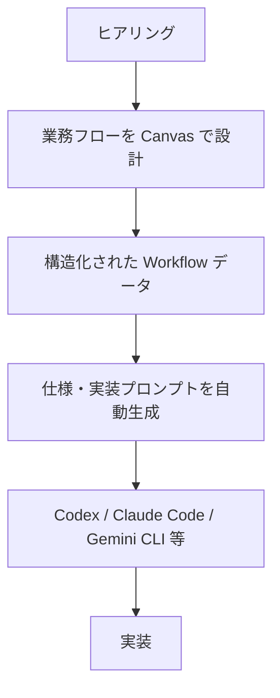

# GOOYA Canvas プロダクト要求定義書

本書は GOOYA Canvas の「何を作るか」を定義する永続的ドキュメントである。
振る舞い・データモデルの詳細は `functional-design.md`、技術選択は `architecture.md` が所有する。

要求 ID 体系:

| 接頭辞 | 対象 |
|---|---|
| `FR-xxx` | 機能要件 |
| `NFR-xxx` | 非機能要件 |
| `US-xxx` | ユーザーストーリー |
| `AC-xxx` | 受け入れ条件 |

---

## 1. プロダクトビジョンと目的

### コンセプト

**業務を描く。実装につなぐ。**

GOOYA Canvas は、FDE・AIエンジニア・開発者がクライアントや社内依頼者へのヒアリングを行いながら、業務フローを視覚的に設計する Web アプリケーションである。Draw.io のようにノードと線で業務フローを組み立てるが、単なる図ではなく、各ノードに「トリガー」「条件分岐」「待機」「人間による作業」「通知」「AI処理」などの**意味**を持たせ、完成したフローから AI コーディングツールへ渡せる**実装プロンプトを自動生成**する。

### プロダクトの位置づけ（最重要の設計思想）

- GOOYA Canvas 自体は**業務自動化を実行するシステムではない**。業務要件を実装可能な形へ変換する **Design Tool / Requirement Engineering Tool** である。
- Power Automate や n8n の**競合にしない**。Power Automate、GAS、Cloudflare、Azure Functions、n8n などは、GOOYA Canvas が作った設計の**実装先**と捉える。
- 蓄積すべき資産は単なるソースコードではなく、GOOYA がどう業務を分析し、どう改善したかという**「業務改善の設計図」そのもの**である。これを中核思想とする。

## 2. ターゲットユーザーと課題・ニーズ

### Primary User

GOOYA 社内の以下の職種。基本的には**開発者側が利用する**ツールであり、依頼者へ「自分でノーコード開発してください」と要求するツールではない。

- FDE
- AIコンサルタント
- AIエンジニア
- Web/業務システム開発者

中心となる用途は、FDE がヒアリングをしながら Canvas を操作し、「現在の業務はこういう流れですね」「この場合はどうなりますか？」「ここで誰が判断しますか？」と確認しながら業務を構造化することである。

### Secondary User

ツール操作に慣れた依頼者・業務担当者。自身でフローを作成して開発者へ渡す使い方を許容する。

### 解決したい課題

業務改善案件では、依頼内容が曖昧な自然言語から始まることが多い。

> 例: 「Google Calendar で面接が終わった1時間後に Teams で評価を催促したい」

しかし実装には、対象 Calendar の特定・面接終了の定義・キャンセル時の処理・面接官の特定方法・評価済み判定方法・通知先・営業時間外の扱い・再通知条件・最大通知回数・API 失敗時・重複実行時など、多数の追加要件の整理が必要になる。

現在これらは会話・メモ・Draw.io・仕様書・チャットへ**分散して記録**されている。GOOYA Canvas は、業務フローそのものを**構造化データとして保持**し、そのデータから実装仕様を生成することでこの分散を解消する。

## 3. 主要な機能の定義

MVP は次の 5 つの機能群で構成される。

1. **Workflow Canvas** — ノードと線による業務フローの視覚的設計。Draw.io に近い操作感（ノード追加・移動・接続・削除・複製、複数選択、ズーム/パン、MiniMap、Undo/Redo）。
2. **Node Inspector / Edge 設定** — 各ノード・エッジに意味（Node Type ごとの設定値、条件分岐ラベル等）を持たせる編集機能。
3. **Project Persistence** — サーバーを持たず、プロジェクトをファイル（`*.gooya-canvas.json`）として保存・読込する。
4. **Export** — Canvas 全体の PNG / PDF 出力。
5. **Prompt Generator と Flow Review** — 中心機能。Workflow の構造化データから決定論的に Markdown 実装プロンプトを生成し、Rule-based で要件不足（未接続ノード、Trigger/End 欠落、必須設定の欠落等）を指摘する。

ノードの種類（MVP で提供する Node Palette）: **Trigger / Data Source / Action / Condition / Wait / Human Task / Notification / AI / Integration / End / Note** の 11 種類。各ノードの設定項目・振る舞いの詳細は `functional-design.md` が所有する。

### MVP スコープ外（実装しないもの）

- ユーザー認証 / DB / サーバー保存
- リアルタイム共同編集 / プロジェクト共有機能 / 権限管理
- Google Drive API 連携 / Microsoft Graph 連携
- Power Automate 実行 / Cloudflare Workflow 実行 / GAS 生成・デプロイ
- AI による直接的なコード実行

### MVP 後の拡張候補（development-roadmap §4、MVP に含めない）

- AI Draft（自然言語 → Workflow 生成）/ AI Review / AI Enhance Prompt
- Auto Layout（Tidy Flow）
- Swimlane（人・部署・システムの責任範囲の可視化）
- Templates（社内業務改善事例の `.gooya-canvas.json` テンプレート提供）
- 巨大 Workflow の PDF 複数ページ分割

## 4. 成功の定義

### 定性的な成功条件

- FDE がヒアリング中にその場で業務フローを構造化でき、抜け漏れ（Flow Review の指摘）を追加ヒアリングに繋げられる。
- 生成された実装プロンプトを Codex / Claude Code 等へそのまま渡して実装に着手できる。
- 完成した Canvas をテンプレートとして次案件で再利用でき、「業務改善の設計図」が資産として蓄積される（Templates 機能自体は MVP 後の拡張候補（development-roadmap §4））。

### 測定可能な成功条件

- 「7. 受け入れ条件」の MVP Acceptance Criteria をすべて満たすこと。
- 外部 LLM API なしでもプロンプト生成・レビューが成立すること（AI API なしで価値が成立する構造）。
- 定量的 KPI（利用案件数、プロンプト採用率、ヒアリング工数削減率など）: （要確認）— 初期要求メモに定義がない。

## 5. ビジネス要件

- **利用主体**: GOOYA 社内（FDE・AIコンサルタント・AIエンジニア・開発者）。社外提供・課金の計画は（要確認）。
- **データ主権**: クライアント業務情報を扱うため、MVP では Workflow データをサーバーへ送信せず Browser Only で処理する。外部 LLM API キーをアプリへハードコードしない。将来 AI API を導入する場合は BYOK / 社内 API Gateway / Azure OpenAI / OpenAI API Proxy 等を別途検討する。
- **運用コスト**: サーバー・DB・認証を持たないため、MVP のランニングコストは静的ホスティングのみで成立する構成とする（ホスティング先は GitHub Pages（architecture.md AD-12 で確定））。
- **資産化**: 成功した Canvas をテンプレート化し次案件で再利用するサイクル（MVP 後の拡張候補（development-roadmap §4））を見据え、プロジェクトファイルは Git 管理・解析が容易な JSON 形式とする。
- **将来拡張の前提**: SSO・組織認証・AI API proxy・Google Drive 直接保存・プロジェクト共有・共同編集・Audit Log を実装する時点で、フルスタック構成（Next.js 等）を再検討する。MVP ではこれらを考慮した過剰設計をしない。
- 納期・予算・リリース時期: （要確認）— 初期要求メモに定義がない。

## 6. ユーザーストーリー

| ID | ストーリー |
|---|---|
| US-001 | FDE として、ヒアリングをしながらノードと線で業務フローを組み立てたい。依頼者の曖昧な要望をその場で構造化するためである。 |
| US-002 | FDE として、各ノードにトリガー・条件・待機・通知などの意味と設定値を持たせたい。図が単なる絵ではなく実装仕様の素材になるためである。 |
| US-003 | FDE として、Flow Review で要件不足（未接続、Trigger なし、Recipient 未設定等）の指摘を受けたい。追加ヒアリングすべき点を見落とさないためである。 |
| US-004 | 開発者として、完成した Workflow から Markdown 実装プロンプトをワンクリックで生成しコピーしたい。Codex / Claude Code 等へそのまま渡して実装を始めるためである。 |
| US-005 | FDE として、プロジェクトを `.gooya-canvas.json` として保存し、PC / Google Drive / SharePoint 等へ自分で配置したい。サーバーなしでも案件データを管理・共有するためである。 |
| US-006 | FDE として、保存したプロジェクトファイルを開いて編集を再開したい。ヒアリングが複数回に分かれるためである。 |
| US-007 | FDE として、Canvas 全体を PNG / PDF で出力したい。依頼者への確認資料として共有するためである。 |
| US-008 | 開発者として、操作を Undo / Redo したい。ヒアリング中の試行錯誤を安全に行うためである。 |
| US-009 | ツール操作に慣れた業務担当者として、自分で業務フローを作成して開発者へファイルで渡したい。（Secondary User） |
| US-010 | 初めて使うユーザーとして、空 Canvas ではなくサンプルプロジェクト（Interview Evaluation Reminder）を参照したい。使い方と到達点を理解するためである。 |

## 7. 受け入れ条件

初期要求メモ「MVP Acceptance Criteria」に基づく。

### Canvas

- AC-001: Node を Palette から追加できる
- AC-002: Node を自由に移動できる
- AC-003: Node 同士を接続できる
- AC-004: Edge を削除できる
- AC-005: Node を削除できる
- AC-006: Node を複製できる
- AC-007: Zoom / Pan できる
- AC-008: Fit View できる
- AC-009: MiniMap が使える

### Inspector

- AC-010: Node 選択で設定を編集できる
- AC-011: 編集内容が即 Canvas へ反映される

### Persistence

- AC-012: `.gooya-canvas.json` を Download できる
- AC-013: 保存したファイルを再読込できる
- AC-014: 読込前後で Node 位置・Edge・設定が一致する
- AC-015: 不正 JSON を読み込んでもアプリが壊れない

### Export

- AC-016: Canvas 全体を PNG 化できる
- AC-017: Canvas 全体を PDF 化できる
- AC-018: Export 画像に Editor UI（Handles / Selection Border / MiniMap / Controls / Inspector / Toolbar / Grid）が含まれない
- AC-019: Canvas の端が切れない（Viewport ではなく全 Node / Edge の Bounding Box を出力対象とする）

### Prompt

- AC-020: Workflow から Markdown Prompt を生成できる
- AC-021: Node 順序と分岐が Prompt へ反映される
- AC-022: Node 設定値が Prompt へ反映される
- AC-023: Prompt を Clipboard へコピーできる

### Review

- AC-024: 未接続 Node を検出できる
- AC-025: Trigger なしを検出できる
- AC-026: End なしを検出できる
- AC-027: Condition の未接続 Branch を検出できる
- AC-028: 必須 Node 設定の欠落を検出できる

## 8. 機能要件

### Canvas 編集

- FR-001: ノードを Palette から Canvas へ追加できる。ノード種別は Trigger / Data Source / Action / Condition / Wait / Human Task / Notification / AI / Integration / End / Note の 11 種類とする。
- FR-002: ノードのドラッグ移動・接続・削除・複製・複数選択ができる。
- FR-003: ズーム / パン / Fit View / MiniMap を提供する。
- FR-004: Grid・Snap to Grid・Selection Rectangle・Context Menu（Edit / Duplicate / Delete）・Edge Label を提供し、Draw.io に近い操作感とする。
- FR-005: ノード編集操作（Node の追加・削除・移動・編集、Edge の追加・削除・編集）を Undo / Redo できる。Viewport の Zoom / Pan は History 対象外とする。
- FR-006: キーボードショートカット（Delete、Ctrl+Z、Ctrl+Shift+Z、Ctrl+D、Ctrl+C/V、Ctrl+S、Ctrl+O、Ctrl+A）を提供する。Input / Textarea 入力中は Canvas ショートカットを無効化する。
- FR-007: Node Type に応じた接続ルールを持つ（例: Trigger は incoming 0、End は outgoing 0、自己接続禁止）。Retry 等の Loop があり得るため Cycle 自体は禁止しない。

### ノード・エッジの意味づけ

- FR-008: ノードには icon・node type・title・short description を表示し、詳細情報は Inspector に表示する（Canvas 上に情報を詰め込みすぎない）。
- FR-009: ノード選択で Inspector を表示し、共通項目（Name / Description / Node Type / Notes）と Node Type ごとの専用設定を編集できる。
- FR-010: Edge にラベル（Yes / No / Completed / Pending 等）を持たせられる。Condition ノードは最低 2 つの分岐を持ち、分岐ラベルはユーザーが変更できる。

### プロジェクト管理

- FR-011: 新規プロジェクトを作成できる。
- FR-012: プロジェクトを `{project-name}.gooya-canvas.json` としてダウンロード保存できる。保存前に schema validation を行う。
- FR-013: プロジェクトファイルを開ける。読込時に validation と schema migration を行い、異常ファイルの場合は Canvas を破壊せず「このファイルを開けませんでした。GOOYA Canvas のプロジェクトファイルか確認してください。」と表示する。
- FR-014: プロジェクトファイルは `schemaVersion`（初期値 "1.0"）を必ず持ち、将来のスキーマ変更時に migration できる。
- FR-015: 初回起動時にサンプルプロジェクト「Interview Evaluation Reminder」を Reference Workflow として提供する。

### Export

- FR-016: Canvas 全体（全 Node / Edge の Bounding Box）を高解像度 PNG として出力できる。
- FR-017: Canvas 全体を 1 ページに Fit させた PDF として出力できる。PDF には Project Name・Workflow・Generated Date 程度の情報を含めてよい。
- FR-018: Export 時に Editor UI（Handles / Selection Border / MiniMap / Controls / Inspector / Toolbar / Grid）を非表示にする。

### Prompt Generator

- FR-019: Workflow の構造化データから**決定論的に** Markdown 実装プロンプトを生成する。外部 AI へ Canvas の内容を送信しなくても動作すること。
- FR-020: Prompt Panel（Drawer または Modal）で生成結果を表示し、Clipboard へコピーできる。
- FR-021: Implementation Target（Generic / Google Apps Script / Power Automate / Cloudflare / Azure / Web Application / Other）を選択でき、Prompt へ反映する。MVP では Target 別の細かいコード生成は不要（Prompt 内への Target 明記程度でよい）。
- FR-022: Note ノードは Workflow 処理としては必須でないが、Prompt へコメントとして出力可能とする。

### Flow Review

- FR-023: Canvas を Rule-based で解析し、ERROR（Trigger なし / End なし / 未接続 Node 等）、WARNING（Condition の分岐未接続 / 必須設定の欠落等）、INFO（API 失敗時処理の未定義 / 重複実行対策の未記載 / Logging の未記載等）の 3 段階で要件不足を表示する。
- FR-024: Review 結果のうち Node に関係する問題をクリックすると、該当 Node を選択して Canvas 中央へ移動する。

## 9. 非機能要件

### セキュリティ・プライバシー

- NFR-001: MVP ではサーバーへ Workflow を送信せず、可能な限り Browser Only で処理する。ユーザー認証・DB・サーバー保存を持たない。
- NFR-002: Workflow へ実際の API Key・Password・Access Token・Webhook Secret を保存させない。ノードには「Authentication: OAuth required」等の設計情報のみを保持する。
- NFR-003: 外部 LLM API キーをアプリへハードコードしない。MVP は AI API なしで価値が成立する構造とする。
- NFR-004: 外部フォント・外部スクリプトは必要最低限とし、可能であれば System Font と Bundled Icons を利用する。

### 信頼性・データ保全

- NFR-005: 読み込んだプロジェクト JSON は必ず validate し、未知・破損・古い schemaVersion のファイルをそのまま state へ入れない。異常ファイルで既存の Canvas 状態を破壊しない。
- NFR-006: 正式な保存先はプロジェクトファイルとする。UX 向上のため localStorage による一時的な Crash Recovery（「Unsaved recovery data found. Restore?」）を実装してもよいが、正式保存としては扱わない。

### 互換性・可搬性

- NFR-007: プロジェクトファイルは人間が解析・デバッグでき、Git 管理が容易な JSON 形式（`*.gooya-canvas.json`）とする。
- NFR-008: schemaVersion による前方 migration（例: 1.0 → 1.1）を可能とし、旧バージョンのファイルを開けるようにする。
- NFR-009: デスクトップブラウザでの利用を前提とする。対応ブラウザの具体的な範囲は（要確認）。モバイル対応は要求されていない。

### 保守性・拡張性

- NFR-010: Canvas UI（レンダリング・操作）と Workflow Domain Model を分離する。プロダクトの本当の資産は Workflow Domain Model であり、JSON 保存・Prompt 生成・Review はすべて Domain Model を入力とする（UI 実装の内部型を直接読まない）。技術的な担保方法は `architecture.md` が所有する。
- NFR-011: 特定 AI Provider・特定 UI フレームワークへ強く依存させない。

### パフォーマンス

- NFR-012: 具体的な性能目標（扱えるノード数の上限、Export 解像度、応答時間など）は（要確認）— 初期要求メモに数値定義がない。PNG / PDF Export は「高解像度」で「Canvas の端が切れない」ことのみが要求されている。
